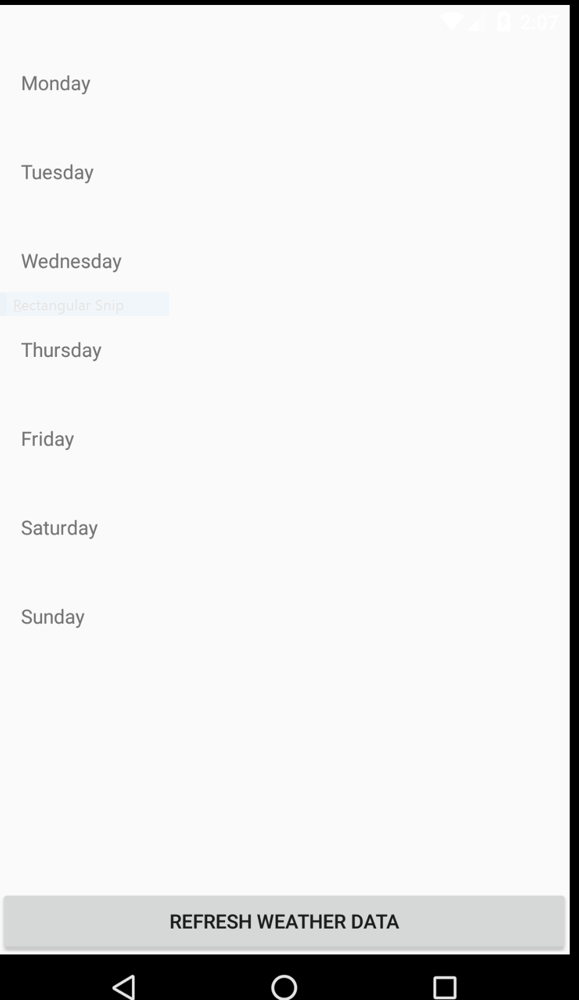
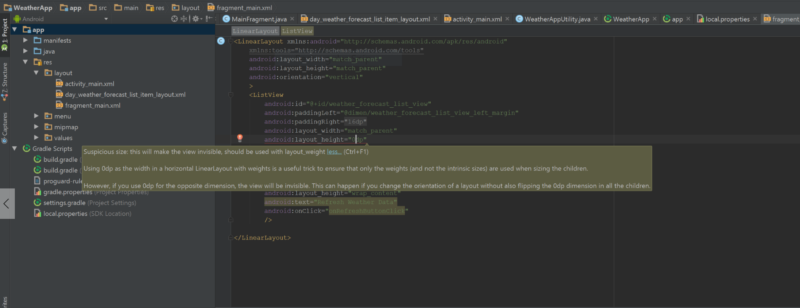
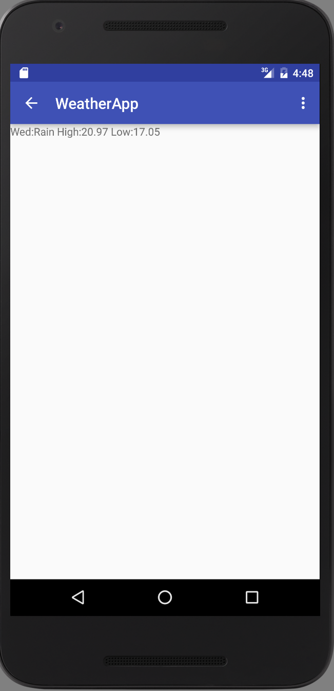

# Creating the project

**Changing the icon**


An attempt to change the icon reveals the location of the default launcher


Select the newly added weather icon


After selecting the icon


## Running the project from the command line

**Running Gradle from the Command line**

> WeatherApp$ ls

```
app  build  build.gradle  gradle  gradle.properties  gradlew  gradlew.bat  local.properties  README.md  settings.gradle  WeatherApp.iml
```

> WeatherApp$ ./gradlew tasks

```
Downloading https://services.gradle.org/distributions/gradle-2.4-all.zip
.......................................................................................................................................................................................................................................................................................................................................................................................................................................................................................................................................................................................................................................................................................................................................................................................................................................................................................................................................................................................................................................................................................................................................................................................................................................................................................................................................................................................................................................................................................................................................................................................................................................................................................................................................................................................................................................................................................................................................................................................................................................................................................................................................................................................................................................................................................................................................................................................................................................................................................................................................................................................................................................................................................................................................................................................................................................................................................................................................................................................................................................................................................................................................................................................................................................................................................................................................................................................................
Unzipping /home/droid/.gradle/wrapper/dists/gradle-2.4-all/3i2gobhdl0fm2tosnn15g540i0/gradle-2.4-all.zip to /home/droid/.gradle/wrapper/dists/gradle-2.4-all/3i2gobhdl0fm2tosnn15g540i0
Set executable permissions for: /home/droid/.gradle/wrapper/dists/gradle-2.4-all/3i2gobhdl0fm2tosnn15g540i0/gradle-2.4/bin/gradle
:tasks

------------------------------------------------------------
All tasks runnable from root project
------------------------------------------------------------

Android tasks
-------------
androidDependencies - Displays the Android dependencies of the project.
signingReport - Displays the signing info for each variant.
sourceSets - Prints out all the source sets defined in this project.

Build tasks
-----------
assemble - Assembles all variants of all applications and secondary packages.
assembleAndroidTest - Assembles all the Test applications.
assembleDebug - Assembles all Debug builds.
assembleRelease - Assembles all Release builds.
build - Assembles and tests this project.
buildDependents - Assembles and tests this project and all projects that depend on it.
buildNeeded - Assembles and tests this project and all projects it depends on.
compileDebugAndroidTestSources
compileDebugSources
compileDebugUnitTestSources
compileReleaseSources
compileReleaseUnitTestSources
mockableAndroidJar - Creates a version of android.jar that's suitable for unit tests.

Build Setup tasks
-----------------
init - Initializes a new Gradle build. [incubating]
wrapper - Generates Gradle wrapper files. [incubating]

Help tasks
----------
components - Displays the components produced by root project 'WeatherApp'. [incubating]
dependencies - Displays all dependencies declared in root project 'WeatherApp'.
dependencyInsight - Displays the insight into a specific dependency in root project 'WeatherApp'.
help - Displays a help message.
model - Displays the configuration model of root project 'WeatherApp'. [incubating]
projects - Displays the sub-projects of root project 'WeatherApp'.
properties - Displays the properties of root project 'WeatherApp'.
tasks - Displays the tasks runnable from root project 'WeatherApp' (some of the displayed tasks may belong to subprojects).

Install tasks
-------------
installDebug - Installs the Debug build.
installDebugAndroidTest - Installs the android (on device) tests for the Debug build.
uninstallAll - Uninstall all applications.
uninstallDebug - Uninstalls the Debug build.
uninstallDebugAndroidTest - Uninstalls the android (on device) tests for the Debug build.
uninstallRelease - Uninstalls the Release build.

Verification tasks
------------------
check - Runs all checks.
clean - Deletes the build directory.
connectedAndroidTest - Installs and runs instrumentation tests for all flavors on connected devices.
connectedCheck - Runs all device checks on currently connected devices.
connectedDebugAndroidTest - Installs and runs the tests for debug on connected devices.
deviceAndroidTest - Installs and runs instrumentation tests using all Device Providers.
deviceCheck - Runs all device checks using Device Providers and Test Servers.
lint - Runs lint on all variants.
lintDebug - Runs lint on the Debug build.
lintRelease - Runs lint on the Release build.
test - Run unit tests for all variants.
testDebugUnitTest - Run unit tests for the debug build.
testReleaseUnitTest - Run unit tests for the release build.

Other tasks
-----------
clean
jarDebugClasses
jarReleaseClasses
lintVitalRelease - Runs lint on just the fatal issues in the Release build.

To see all tasks and more detail, run gradlew tasks --all

To see more detail about a task, run gradlew help --task <task>

BUILD SUCCESSFUL

Total time: 1 mins 43.7 secs

This build could be faster, please consider using the Gradle Daemon: http://gradle.org/docs/2.4/userguide/gradle_daemon.html
```

**Build the app from the command line using gradle**

Grant execution permission to the gradle wrapper script, if needed.

> WeatherApp$ ./chmod +x gradlew

> WeatherApp$ ./gradlew assembleDebug

```
:app:preBuild UP-TO-DATE
:app:preDebugBuild UP-TO-DATE
:app:checkDebugManifest
:app:preReleaseBuild UP-TO-DATE
:app:prepareComAndroidSupportAppcompatV72311Library UP-TO-DATE
:app:prepareComAndroidSupportDesign2311Library UP-TO-DATE
:app:prepareComAndroidSupportRecyclerviewV72311Library UP-TO-DATE
:app:prepareComAndroidSupportSupportV42311Library UP-TO-DATE
:app:prepareDebugDependencies
:app:compileDebugAidl UP-TO-DATE
:app:compileDebugRenderscript UP-TO-DATE
:app:generateDebugBuildConfig UP-TO-DATE
:app:generateDebugAssets UP-TO-DATE
:app:mergeDebugAssets UP-TO-DATE
:app:generateDebugResValues UP-TO-DATE
:app:generateDebugResources UP-TO-DATE
:app:mergeDebugResources UP-TO-DATE
:app:processDebugManifest UP-TO-DATE
:app:processDebugResources UP-TO-DATE
:app:generateDebugSources UP-TO-DATE
:app:processDebugJavaRes UP-TO-DATE
:app:compileDebugJavaWithJavac UP-TO-DATE
:app:compileDebugNdk UP-TO-DATE
:app:compileDebugSources UP-TO-DATE
:app:preDexDebug UP-TO-DATE
:app:dexDebug UP-TO-DATE
:app:validateDebugSigning
:app:packageDebug UP-TO-DATE
:app:zipalignDebug UP-TO-DATE
:app:assembleDebug UP-TO-DATE

BUILD SUCCESSFUL

Total time: 25.355 secs

This build could be faster, please consider using the Gradle Daemon: http://gradle.org/docs/2.4/userguide/gradle_daemon.html
```

The apk file is generated at *WeatherApp/app/build/outputs/apk* directory

> WeatherApp$ ls app/build/outputs/apk

```
app-debug.apk  app-debug-unaligned.apk
```

### Testing on a physical device

List out attached devices 

> WeatherApp$ adb devices

```
List of devices attached
emulator-5554	device
```
**Enable USB Debugging on the device**

Connect an Android device to the laptop

Go to Settings -> About Phone and tap on Build Number option for 7 times to "unhide" Setting -> Developer Options menu.

In Setting -> Developer Options, Turn on USB Debugging

**Setup computer to detect device**

Not sure if following any of these helped, but I tried them before I was able to install the app on the device.

*Created the following file*

/etc/udev/rules.d/51-android.rules

with the following content

SUBSYSTEM=="usb", ATTR{idVendor}=="18d1", MODE="0666", GROUP="plugdev"

> sudo service udev restart

> lsusb

```
Bus 002 Device 002: ID 8087:0024 Intel Corp. Integrated Rate Matching Hub
Bus 002 Device 001: ID 1d6b:0002 Linux Foundation 2.0 root hub
Bus 001 Device 005: ID 0c45:64ad Microdia 
Bus 001 Device 004: ID 0bda:0129 Realtek Semiconductor Corp. RTS5129 Card Reader Controller
Bus 001 Device 003: ID 8087:07da Intel Corp. 
Bus 001 Device 002: ID 8087:0024 Intel Corp. Integrated Rate Matching Hub
Bus 001 Device 001: ID 1d6b:0002 Linux Foundation 2.0 root hub
Bus 004 Device 001: ID 1d6b:0003 Linux Foundation 3.0 root hub
Bus 003 Device 002: ID 046d:c52f Logitech, Inc. Unifying Receiver
Bus 003 Device 037: ID 18d1:4ee2 Google Inc. Nexus 4 (debug)
Bus 003 Device 001: ID 1d6b:0002 Linux Foundation 2.0 root hub
```

*References*

<http://developer.android.com/tools/device.html>

<http://bernaerts.dyndns.org/linux/74-ubuntu/328-ubuntu-trusty-android-adb-fastboot-qtadb>

**Verify if the device is detected**

> WeatherApp$ adb devices

```
List of devices attached
06f3f1240074bbbd	device   <-----
emulator-5554	device
```

**Install app on the physical device from the command line**

> WeatherApp$ adb -d install -r app/build/outputs/apk/app-debug-unaligned.apk

-d, a switch to adb command => directs command to the only connected USB device

-r, a switch to install subcommand => replace existing application

**Start MainActivity from the command line**

> WeatherApp$ adb -d shell am start -n com.gruprog.weatherapp/com.gruprog.weatherapp.MainActivity

-d, a switch to adb command => directs command to the only connected USB device

adb shell \<command\> => run remote shell command

Use the activity manager tool (am) to start the MainActivity.

## Running the project from the IDE

Hit the run button and choose the physical device attached as shown below


-----------

# Creating a list of weather forecasts with Mock Data

**Create a layout for the MainActivity**

*res/layout/activity_main.xml*

```xml
<FrameLayout xmlns:android="http://schemas.android.com/apk/res/android"
    xmlns:tools="http://schemas.android.com/tools"
    android:id="@+id/root_container"    -------------
    android:layout_width="match_parent"
    android:layout_height="match_parent"
/>
```

## Create a fragment to display a list of weather forecasts

**Creating a layout for the fragment**

*res/layout/fragment_main.xml*

```xml
<FrameLayout xmlns:android="http://schemas.android.com/apk/res/android"
    xmlns:tools="http://schemas.android.com/tools"
    android:layout_width="match_parent"
    android:layout_height="match_parent"
    android:paddingRight="@dimen/activity_horizontal_margin"
    android:paddingTop="@dimen/activity_vertical_margin"
    android:paddingBottom="@dimen/activity_vertical_margin"
    >
    <ListView 
        android:id="@+id/weather_forecast_list_view"   -------------
        android:paddingLeft="@dimen/weather_forecast_list_view_left_margin"
        android:paddingRight="@dimen/weather_forecast_list_view_left_margin"
        android:layout_width="match_parent"
        android:layout_height="match_parent"
        android:divider="@null"
        />
</FrameLayout>
```

Since the layout of the fragment holds only a single child view i.e. the ListView, it is efficient to use FrameLayout.

The attributes *android:paddingLeft* and *android:paddingRight* are added to the ListView so that each TextView in the ListView appears not exactly aligned with the left edge of the ListView.

**Implementing the Fragment class**

```java
public class MainFragment extends Fragment {
    ArrayAdapter<String> weatherDataAdapter;

    @Nullable
    @Override
    public View onCreateView(LayoutInflater inflater, ViewGroup container, Bundle savedInstanceState) {
        String[] weatherData = {
                "Monday",
                "Tuesday",
                "Wednesday",
                "Thursday",
                "Friday",
                "Saturday",
                "Sunday"
        };

        List<String> weatherDataList = new ArrayList<>(Arrays.asList(weatherData));

        weatherDataAdapter = new ArrayAdapter<>(
                this.getActivity(),
                R.layout.day_weather_forecast_list_item_layout, /* Point to the resource ID of the layout that contains the view for each item in the list */
                R.id.day_weather_forecast_list_item_text_view, /* Point to the resource ID of the View in the above specified layout, that the adapter
                 instantiates per (and initializes with each) data element to display a list of those views/data items in the ListView. */
                weatherDataList);

        View rootView = inflater.inflate(R.layout.fragment_main, container, false);

        ListView listView = (ListView) rootView.findViewById(R.id.weather_forecast_list_view);
        listView.setAdapter(weatherDataAdapter);

        return rootView;
    }
}
```

**Defining the layout file containing the view for each item in the Weather Data List (Mock Data)**

*res/layout/day_weather_forecast_list_item_layout.xml*

```xml
<TextView xmlns:android="http://schemas.android.com/apk/res/android"
    android:layout_width="match_parent"
    android:layout_height="wrap_content"
    android:gravity="center_vertical"
    android:minHeight="?android:attr/listPreferredItemHeight"
    android:id="@+id/day_weather_forecast_list_item_text_view"   ---------
    />
```

*android:minHeight="?android:attr/listPreferredItemHeight"* is specified to give enough room to make the item tappable.

*android:gravity="center_vertical"* is specified to align each weather entry vertically in the center of the TextView it is diplayed in.

**Instantiate the Fragment class in MainActivity**

```java
public class MainActivity extends AppCompatActivity {

    @Override
    protected void onCreate(Bundle savedInstanceState) {
        super.onCreate(savedInstanceState);
        setContentView(R.layout.activity_main);

        if(savedInstanceState == null) {
            /*
                add an instance of the MainFragment at R.id.root_container
             */
            getSupportFragmentManager().beginTransaction()
                    .add(R.id.root_container, new MainFragment())
                    .commit();
        }
    }
```

**Snapshot**


-----------------

# Getting Weather Data from http://openweathermap.org/

**Getting an API Key**

Sign up and get an API Key from <http://openweathermap.org/appid>

**Getting weather information from the API**

Sample Request:

```
http://api.openweathermap.org/data/2.5/forecast/daily?q=M6R2H6&mode=json&units=metric&cnt=7&APPID=<api key>
```

which when requested in the browser returns

```
{"city":{"id":6160378,"name":"Swansea","coord":{"lon":-79.466301,"lat":43.633419},"country":"CA","population":0},"cod":"200","message":0.0115,"cnt":7,"list":[{"dt":1459098000,"temp":{"day":7.07,"min":7.07,"max":7.07,"night":7.07,"eve":7.07,"morn":7.07},"pressure":983.75,"humidity":91,"weather":[{"id":500,"main":"Rain","description":"light rain","icon":"10d"}],"speed":4.57,"deg":112,"clouds":92,"rain":0.76},{"dt":1459184400,"temp":{"day":9.63,"min":-0.84,"max":9.63,"night":-0.84,"eve":3.03,"morn":8.24},"pressure":971.08,"humidity":93,"weather":[{"id":800,"main":"Clear","description":"clear sky","icon":"01d"}],"speed":4.31,"deg":185,"clouds":88,"rain":14.28,"snow":0.02},{"dt":1459270800,"temp":{"day":4.51,"min":-5.78,"max":5.81,"night":-5.78,"eve":1.89,"morn":-4.76},"pressure":1001.9,"humidity":44,"weather":[{"id":800,"main":"Clear","description":"clear sky","icon":"01d"}],"speed":6.96,"deg":337,"clouds":0},{"dt":1459357200,"temp":{"day":8.6,"min":-5,"max":8.94,"night":7.43,"eve":7.05,"morn":-5},"pressure":999.62,"humidity":57,"weather":[{"id":801,"main":"Clouds","description":"few clouds","icon":"02d"}],"speed":6.26,"deg":207,"clouds":12},{"dt":1459443600,"temp":{"day":7.37,"min":4.7,"max":11.16,"night":10.41,"eve":11.16,"morn":4.7},"pressure":998.46,"humidity":0,"weather":[{"id":501,"main":"Rain","description":"moderate rain","icon":"10d"}],"speed":4.67,"deg":141,"clouds":95,"rain":11},{"dt":1459530000,"temp":{"day":12.81,"min":-1.39,"max":12.81,"night":-1.39,"eve":3.88,"morn":11.66},"pressure":981.61,"humidity":0,"weather":[{"id":501,"main":"Rain","description":"moderate rain","icon":"10d"}],"speed":7.02,"deg":240,"clouds":76,"rain":6.49},{"dt":1459616400,"temp":{"day":4.18,"min":-5.08,"max":4.18,"night":-5.08,"eve":-1.92,"morn":-1.17},"pressure":987,"humidity":0,"weather":[{"id":601,"main":"Snow","description":"snow","icon":"13d"}],"speed":11.19,"deg":241,"clouds":87,"rain":2.51,"snow":3.78}]}
```

The approach to get the weather information from the API is 

* Make an HTTP request to the API
* Read the response from the input stream
* Log errors, if any
* Disconnect and clean up

Add the following in *WeatherApp/app/build.gradle*

```groovy
apply plugin: 'com.android.application'

android {
    compileSdkVersion 23
    buildToolsVersion "23.0.2"

    defaultConfig {
        applicationId "com.gruprog.weatherapp"
        minSdkVersion 16
        targetSdkVersion 23
        versionCode 1
        versionName "1.0"
    }
    buildTypes {
        release {
            minifyEnabled false
            proguardFiles getDefaultProguardFile('proguard-android.txt'), 'proguard-rules.pro'
        }
    }

    buildTypes.each {    <----------
		it.buildConfigField 'String', 'OPEN_WEATHER_MAP_URL', '"http://api.openweathermap.org/data/2.5/forecast/daily?"'
        it.buildConfigField 'String', 'OPEN_WEATHER_MAP_API_KEY', '"<API KEY OBTAINED FROM THE SITE>"'
    }
}

dependencies {
    compile fileTree(dir: 'libs', include: ['*.jar'])
    testCompile 'junit:junit:4.12'
    compile 'com.android.support:appcompat-v7:23.1.1'
    compile 'com.android.support:design:23.1.1'
}
```

The above snippet automatically generates a couple of fields in BuildConfig.java called OPEN_WEATHER_MAP_URL of type String with the URL supplied to it as its value and 
OPEN_WEATHER_MAP_API_KEY of type String with the API key supplied to it as its value. These fields can then be referred to in code.

A snapshot with OPEN_WEATHER_MAP_API_KEY generated is shown below. All the fields specified are generated in both the BuildConfig files in different paths as shown in the snapshot. 


```java
public class MainFragment extends Fragment {
    private static final String TAG = MainFragment.class.getSimpleName();

    ArrayAdapter<String> weatherDataAdapter;

    @Nullable
    @Override
    public View onCreateView(LayoutInflater inflater, ViewGroup container, Bundle savedInstanceState) {
        String[] weatherData = {
                "Monday",
                "Tuesday",
                "Wednesday",
                "Thursday",
                "Friday",
                "Saturday",
                "Sunday"
        };

        List<String> weatherDataList = new ArrayList<>(Arrays.asList(weatherData));

        weatherDataAdapter = new ArrayAdapter<>(
                this.getActivity(),
                R.layout.day_weather_forecast_list_item_layout, /* Point to the resource ID of the layout that contains the view for each item in the list */
                R.id.day_weather_forecast_list_item_text_view, /* Point to the resource ID of the View in the above specified layout, that the adapter
                 instantiates per (and initializes with each) data element to display a list of those views/data items in the ListView. */
                weatherDataList);

        View rootView = inflater.inflate(R.layout.fragment_main, container, false);

        ListView listView = (ListView) rootView.findViewById(R.id.weather_forecast_list_view);
        listView.setAdapter(weatherDataAdapter);

        String weatherDataFromOpenWeatherApi = getWeatherData(getURL("M6R2H6")); <------

        return rootView;
    }

    private URL getURL(String cityCode) { <-------
        /*
            URL format is

            http://api.openweathermap.org/data/2.5/forecast/daily?q=<postal code>&mode=<response format>&units=<temp unit>&cnt=<num of day>&APPID=<insert your app key>

            http://api.openweathermap.org/data/2.5/forecast/daily?q=M6R2H6&mode=json&units=metric&cnt=7&APPID=<api key>
         */

        final String baseUrl = BuildConfig.OPEN_WEATHER_MAP_URL;

        final String cityPathParameterKey = "q";
        final String cityPathParameterValue = cityCode;

        final String responseFormatPathParameterKey = "mode";
        final String responseFormatPathParameterValue = "json";

        final String temperatureUnitsPathParameterKey = "units";
        final String temperatureUnitsPathParameterValue = "metric";

        final String numberOfDaysPathParameterKey = "cnt";
        final int numberOfDaysPathParameterValue = 7;

        final String apiPathParameterKey = "APPID";
        final String apiPathParameterValue = BuildConfig.OPEN_WEATHER_MAP_API_KEY;

        Uri uri = Uri.parse(baseUrl).buildUpon()
                .appendQueryParameter(cityPathParameterKey, cityPathParameterValue)
                .appendQueryParameter(responseFormatPathParameterKey, responseFormatPathParameterValue)
                .appendQueryParameter(temperatureUnitsPathParameterKey, temperatureUnitsPathParameterValue)
                .appendQueryParameter(numberOfDaysPathParameterKey, Integer.toString(numberOfDaysPathParameterValue))
                .appendQueryParameter(apiPathParameterKey, apiPathParameterValue)
                .build();

        URL url = null;

        try {
            //Construct the url to access openweathermap api
            url = new URL(uri.toString());
        } catch(MalformedURLException e) {
            Log.e(TAG, "Error occurred", e);
            System.exit(0);
        }

        return url;
    }

    private String getWeatherData(URL url) {  <-------
        HttpURLConnection urlConnection = null;
        BufferedReader bufferedReader = null;

        StringBuffer responseBuffer = new StringBuffer();

        try {
            //Make a request by connecting to the openweathermap api
            urlConnection = (HttpURLConnection) url.openConnection();
            urlConnection.setRequestMethod("GET");
            urlConnection.connect();

            //Read the response
            InputStream inputStream = urlConnection.getInputStream();

            if(inputStream == null) {
                return null;
            }

            bufferedReader = new BufferedReader(new InputStreamReader(inputStream));

            String line = null;

            while ((line = bufferedReader.readLine()) != null) {
                /*
                    adding a new line clearly formats json string, which is helpful when printed to the console
                 */
                responseBuffer.append(line + "\n");
            }
        }catch (IOException e) {
            Log.e(TAG, "Error occurred", e);
        } finally {
            if(urlConnection != null) {
                urlConnection.disconnect();
            }

            if(bufferedReader != null) {
                try {
                    bufferedReader.close();
                }catch(IOException e) {
                    Log.e(TAG, "Error occurred while closing stream", e);
                }
            }
        }

        return (responseBuffer.length() == 0 ? null : responseBuffer.toString());
    }
}
```

Logs can be retrieved from LogCat console built into Android studio or using the following command to retrieve logs related to the only USB attached device.

> WeatherApp$ adb -d logcat

After adding the above code, running the app results in the following error:

```
03-28 07:14:43.126 2140-2140/com.gruprog.weatherapp E/AndroidRuntime: FATAL EXCEPTION: main
03-28 07:14:43.126 2140-2140/com.gruprog.weatherapp E/AndroidRuntime: Process: com.gruprog.weatherapp, PID: 2140
03-28 07:14:43.126 2140-2140/com.gruprog.weatherapp E/AndroidRuntime: java.lang.RuntimeException: Unable to start activity ComponentInfo{com.gruprog.weatherapp/com.gruprog.weatherapp.MainActivity}: android.os.NetworkOnMainThreadException
03-28 07:14:43.126 2140-2140/com.gruprog.weatherapp E/AndroidRuntime:     at android.app.ActivityThread.performLaunchActivity(ActivityThread.java:2416)
03-28 07:14:43.126 2140-2140/com.gruprog.weatherapp E/AndroidRuntime:     at android.app.ActivityThread.handleLaunchActivity(ActivityThread.java:2476)
03-28 07:14:43.126 2140-2140/com.gruprog.weatherapp E/AndroidRuntime:     at android.app.ActivityThread.-wrap11(ActivityThread.java)
03-28 07:14:43.126 2140-2140/com.gruprog.weatherapp E/AndroidRuntime:     at android.app.ActivityThread$H.handleMessage(ActivityThread.java:1344)
03-28 07:14:43.126 2140-2140/com.gruprog.weatherapp E/AndroidRuntime:     at android.os.Handler.dispatchMessage(Handler.java:102)
03-28 07:14:43.126 2140-2140/com.gruprog.weatherapp E/AndroidRuntime:     at android.os.Looper.loop(Looper.java:148)
03-28 07:14:43.126 2140-2140/com.gruprog.weatherapp E/AndroidRuntime:     at android.app.ActivityThread.main(ActivityThread.java:5417)
03-28 07:14:43.126 2140-2140/com.gruprog.weatherapp E/AndroidRuntime:     at java.lang.reflect.Method.invoke(Native Method)
03-28 07:14:43.126 2140-2140/com.gruprog.weatherapp E/AndroidRuntime:     at com.android.internal.os.ZygoteInit$MethodAndArgsCaller.run(ZygoteInit.java:726)
03-28 07:14:43.126 2140-2140/com.gruprog.weatherapp E/AndroidRuntime:     at com.android.internal.os.ZygoteInit.main(ZygoteInit.java:616)
03-28 07:14:43.126 2140-2140/com.gruprog.weatherapp E/AndroidRuntime:  Caused by: android.os.NetworkOnMainThreadException  <---------
03-28 07:14:43.126 2140-2140/com.gruprog.weatherapp E/AndroidRuntime:     at android.os.StrictMode$AndroidBlockGuardPolicy.onNetwork(StrictMode.java:1273)
03-28 07:14:43.126 2140-2140/com.gruprog.weatherapp E/AndroidRuntime:     at java.net.InetAddress.lookupHostByName(InetAddress.java:431)
03-28 07:14:43.126 2140-2140/com.gruprog.weatherapp E/AndroidRuntime:     at java.net.InetAddress.getAllByNameImpl(InetAddress.java:252)
03-28 07:14:43.126 2140-2140/com.gruprog.weatherapp E/AndroidRuntime:     at java.net.InetAddress.getAllByName(InetAddress.java:215)
03-28 07:14:43.126 2140-2140/com.gruprog.weatherapp E/AndroidRuntime:     at com.android.okhttp.internal.Network$1.resolveInetAddresses(Network.java:29)
03-28 07:14:43.126 2140-2140/com.gruprog.weatherapp E/AndroidRuntime:     at com.android.okhttp.internal.http.RouteSelector.resetNextInetSocketAddress(RouteSelector.java:188)
03-28 07:14:43.126 2140-2140/com.gruprog.weatherapp E/AndroidRuntime:     at com.android.okhttp.internal.http.RouteSelector.nextProxy(RouteSelector.java:157)
03-28 07:14:43.126 2140-2140/com.gruprog.weatherapp E/AndroidRuntime:     at com.android.okhttp.internal.http.RouteSelector.next(RouteSelector.java:100)
03-28 07:14:43.126 2140-2140/com.gruprog.weatherapp E/AndroidRuntime:     at com.android.okhttp.internal.http.HttpEngine.createNextConnection(HttpEngine.java:357)
03-28 07:14:43.126 2140-2140/com.gruprog.weatherapp E/AndroidRuntime:     at com.android.okhttp.internal.http.HttpEngine.nextConnection(HttpEngine.java:340)
03-28 07:14:43.126 2140-2140/com.gruprog.weatherapp E/AndroidRuntime:     at com.android.okhttp.internal.http.HttpEngine.connect(HttpEngine.java:330)
03-28 07:14:43.126 2140-2140/com.gruprog.weatherapp E/AndroidRuntime:     at com.android.okhttp.internal.http.HttpEngine.sendRequest(HttpEngine.java:248)
03-28 07:14:43.126 2140-2140/com.gruprog.weatherapp E/AndroidRuntime:     at com.android.okhttp.internal.huc.HttpURLConnectionImpl.execute(HttpURLConnectionImpl.java:433)
03-28 07:14:43.126 2140-2140/com.gruprog.weatherapp E/AndroidRuntime:     at com.android.okhttp.internal.huc.HttpURLConnectionImpl.connect(HttpURLConnectionImpl.java:114)
03-28 07:14:43.126 2140-2140/com.gruprog.weatherapp E/AndroidRuntime:     at com.gruprog.weatherapp.MainFragment.getWeatherData(MainFragment.java:108) <---------
03-28 07:14:43.126 2140-2140/com.gruprog.weatherapp E/AndroidRuntime:     at com.gruprog.weatherapp.MainFragment.onCreateView(MainFragment.java:57)
03-28 07:14:43.126 2140-2140/com.gruprog.weatherapp E/AndroidRuntime:     at android.support.v4.app.Fragment.performCreateView(Fragment.java:1962)
03-28 07:14:43.126 2140-2140/com.gruprog.weatherapp E/AndroidRuntime:     at android.support.v4.app.FragmentManagerImpl.moveToState(FragmentManager.java:1067)
03-28 07:14:43.126 2140-2140/com.gruprog.weatherapp E/AndroidRuntime:     at android.support.v4.app.FragmentManagerImpl.moveToState(FragmentManager.java:1248)
03-28 07:14:43.126 2140-2140/com.gruprog.weatherapp E/AndroidRuntime:     at android.support.v4.app.BackStackRecord.run(BackStackRecord.java:738)
03-28 07:14:43.126 2140-2140/com.gruprog.weatherapp E/AndroidRuntime:     at android.support.v4.app.FragmentManagerImpl.execPendingActions(FragmentManager.java:1613)
03-28 07:14:43.126 2140-2140/com.gruprog.weatherapp E/AndroidRuntime:     at android.support.v4.app.FragmentController.execPendingActions(FragmentController.java:330)
03-28 07:14:43.126 2140-2140/com.gruprog.weatherapp E/AndroidRuntime:     at android.support.v4.app.FragmentActivity.onStart(FragmentActivity.java:547)
03-28 07:14:43.126 2140-2140/com.gruprog.weatherapp E/AndroidRuntime:     at android.app.Instrumentation.callActivityOnStart(Instrumentation.java:1237)
03-28 07:14:43.126 2140-2140/com.gruprog.weatherapp E/AndroidRuntime:     at android.app.Activity.performStart(Activity.java:6253)
03-28 07:14:43.126 2140-2140/com.gruprog.weatherapp E/AndroidRuntime:     at android.app.ActivityThread.performLaunchActivity(ActivityThread.java:2379)
03-28 07:14:43.126 2140-2140/com.gruprog.weatherapp E/AndroidRuntime:     at android.app.ActivityThread.handleLaunchActivity(ActivityThread.java:2476) 
03-28 07:14:43.126 2140-2140/com.gruprog.weatherapp E/AndroidRuntime:     at android.app.ActivityThread.-wrap11(ActivityThread.java) 
03-28 07:14:43.126 2140-2140/com.gruprog.weatherapp E/AndroidRuntime:     at android.app.ActivityThread$H.handleMessage(ActivityThread.java:1344) 
03-28 07:14:43.126 2140-2140/com.gruprog.weatherapp E/AndroidRuntime:     at android.os.Handler.dispatchMessage(Handler.java:102) 
03-28 07:14:43.126 2140-2140/com.gruprog.weatherapp E/AndroidRuntime:     at android.os.Looper.loop(Looper.java:148) 
03-28 07:14:43.126 2140-2140/com.gruprog.weatherapp E/AndroidRuntime:     at android.app.ActivityThread.main(ActivityThread.java:5417) 
03-28 07:14:43.126 2140-2140/com.gruprog.weatherapp E/AndroidRuntime:     at java.lang.reflect.Method.invoke(Native Method) 
03-28 07:14:43.126 2140-2140/com.gruprog.weatherapp E/AndroidRuntime:     at com.android.internal.os.ZygoteInit$MethodAndArgsCaller.run(ZygoteInit.java:726) 
03-28 07:14:43.126 2140-2140/com.gruprog.weatherapp E/AndroidRuntime:     at com.android.internal.os.ZygoteInit.main(ZygoteInit.java:616) 
```

Notice the following lines from the above log.

```
03-28 07:14:43.126 2140-2140/com.gruprog.weatherapp E/AndroidRuntime:     at com.gruprog.weatherapp.MainFragment.getWeatherData(MainFragment.java:108)
03-28 07:14:43.126 2140-2140/com.gruprog.weatherapp E/AndroidRuntime:     at com.gruprog.weatherapp.MainFragment.onCreateView(MainFragment.java:57)
```

It could be inferred that *android.os.NetworkOnMainThreadException* was caused by the following line in the Fragment class

```java
public class MainFragment extends Fragment {
    private static final String TAG = MainFragment.class.getSimpleName();

    ArrayAdapter<String> weatherDataAdapter;

    @Nullable
    @Override
    public View onCreateView(LayoutInflater inflater, ViewGroup container, Bundle savedInstanceState) {
        String[] weatherData = {
                "Monday",
                "Tuesday",
                "Wednesday",
                "Thursday",
                "Friday",
                "Saturday",
                "Sunday"
        };

        List<String> weatherDataList = new ArrayList<>(Arrays.asList(weatherData));

        weatherDataAdapter = new ArrayAdapter<>(
                this.getActivity(),
                R.layout.day_weather_forecast_list_item_layout, /* Point to the resource ID of the layout that contains the view for each item in the list */
                R.id.day_weather_forecast_list_item_text_view, /* Point to the resource ID of the View in the above specified layout, that the adapter
                 instantiates per (and initializes with each) data element to display a list of those views/data items in the ListView. */
                weatherDataList);

        View rootView = inflater.inflate(R.layout.fragment_main, container, false);

        ListView listView = (ListView) rootView.findViewById(R.id.weather_forecast_list_view);
        listView.setAdapter(weatherDataAdapter);

        String weatherDataFromOpenWeatherApi = getWeatherData(getURL("M6R2H6"));

        return rootView;
    }

    private URL getURL(String cityCode) { 
        /*
            URL format is

            http://api.openweathermap.org/data/2.5/forecast/daily?q=<postal code>&mode=<response format>&units=<temp unit>&cnt=<num of day>&APPID=<insert your app key>

            http://api.openweathermap.org/data/2.5/forecast/daily?q=M6R2H6&mode=json&units=metric&cnt=7&APPID=<api key>
         */

        final String baseUrl = BuildConfig.OPEN_WEATHER_MAP_URL;

        final String cityPathParameterKey = "q";
        final String cityPathParameterValue = cityCode;

        final String responseFormatPathParameterKey = "mode";
        final String responseFormatPathParameterValue = "json";

        final String temperatureUnitsPathParameterKey = "units";
        final String temperatureUnitsPathParameterValue = "metric";

        final String numberOfDaysPathParameterKey = "cnt";
        final int numberOfDaysPathParameterValue = 7;

        final String apiPathParameterKey = "APPID";
        final String apiPathParameterValue = BuildConfig.OPEN_WEATHER_MAP_API_KEY;

        Uri uri = Uri.parse(baseUrl).buildUpon()
                .appendQueryParameter(cityPathParameterKey, cityPathParameterValue)
                .appendQueryParameter(responseFormatPathParameterKey, responseFormatPathParameterValue)
                .appendQueryParameter(temperatureUnitsPathParameterKey, temperatureUnitsPathParameterValue)
                .appendQueryParameter(numberOfDaysPathParameterKey, Integer.toString(numberOfDaysPathParameterValue))
                .appendQueryParameter(apiPathParameterKey, apiPathParameterValue)
                .build();

        URL url = null;

        try {
            //Construct the url to access openweathermap api
            url = new URL(uri.toString());
        } catch(MalformedURLException e) {
            Log.e(TAG, "Error occurred", e);
            System.exit(0);
        }

        return url;
    }

    private String getWeatherData(URL url) {  
        HttpURLConnection urlConnection = null;
        BufferedReader bufferedReader = null;

        StringBuffer responseBuffer = new StringBuffer();

        try {
            //Make a request by connecting to the openweathermap api
            urlConnection = (HttpURLConnection) url.openConnection();
            urlConnection.setRequestMethod("GET");
            urlConnection.connect();  <------------------------------------

            //Read the response
            InputStream inputStream = urlConnection.getInputStream();

            if(inputStream == null) {
                return null;
            }

            bufferedReader = new BufferedReader(new InputStreamReader(inputStream));

            String line = null;

            while ((line = bufferedReader.readLine()) != null) {
                /*
                    adding a new line clearly formats json string, which is helpful when printed to the console
                 */
                responseBuffer.append(line + "\n");
            }
        }catch (IOException e) {
            Log.e(TAG, "Error occurred", e);
        } finally {
            if(urlConnection != null) {
                urlConnection.disconnect();
            }

            if(bufferedReader != null) {
                try {
                    bufferedReader.close();
                }catch(IOException e) {
                    Log.e(TAG, "Error occurred while closing stream", e);
                }
            }
        }

        return (responseBuffer.length() == 0 ? null : responseBuffer.toString());
    }
}
```

**Refactoring the network calling code to be called from an AsyncTask**

As network calls cannot be made on the main thread, refactor the network code to be called from an AsyncTask.

An AsyncTask allows developers to focus on the business logic by easily allowing them to specify running certain parts of the code on the background thread and certain parts on the UI thread, without having to create and manage custom threads. 


```java
public class MainFragment extends Fragment {
    private static final String TAG = MainFragment.class.getSimpleName();

    ArrayAdapter<String> weatherDataAdapter;

    @Nullable
    @Override
    public View onCreateView(LayoutInflater inflater, ViewGroup container, Bundle savedInstanceState) {
        String[] weatherData = {
                "Monday",
                "Tuesday",
                "Wednesday",
                "Thursday",
                "Friday",
                "Saturday",
                "Sunday"
        };

        List<String> weatherDataList = new ArrayList<>(Arrays.asList(weatherData));

        weatherDataAdapter = new ArrayAdapter<>(
                this.getActivity(),
                R.layout.day_weather_forecast_list_item_layout, /* Point to the resource ID of the layout that contains the view for each item in the list */
                R.id.day_weather_forecast_list_item_text_view, /* Point to the resource ID of the View in the above specified layout, that the adapter
                 instantiates per (and initializes with each) data element to display a list of those views/data items in the ListView. */
                weatherDataList);

        View rootView = inflater.inflate(R.layout.fragment_main, container, false);

        ListView listView = (ListView) rootView.findViewById(R.id.weather_forecast_list_view);
        listView.setAdapter(weatherDataAdapter);

        return rootView;
    }

    @Override
    public void onViewCreated(View view, Bundle savedInstanceState)
    {
        super.onViewCreated(view, savedInstanceState);

    }

    private URL getURL(String cityCode) {
        /*
            URL format is

            http://api.openweathermap.org/data/2.5/forecast/daily?q=<postal code>&mode=<response format>&units=<temp unit>&cnt=<num of day>&APPID=<insert your app key>

            http://api.openweathermap.org/data/2.5/forecast/daily?q=M6R2H6&mode=json&units=metric&cnt=7&APPID=<api key>
         */

        final String baseUrl = BuildConfig.OPEN_WEATHER_MAP_URL;

        final String cityPathParameterKey = "q";
        final String cityPathParameterValue = cityCode;

        final String responseFormatPathParameterKey = "mode";
        final String responseFormatPathParameterValue = "json";

        final String temperatureUnitsPathParameterKey = "units";
        final String temperatureUnitsPathParameterValue = "metric";

        final String numberOfDaysPathParameterKey = "cnt";
        final int numberOfDaysPathParameterValue = 7;

        final String apiPathParameterKey = "APPID";
        final String apiPathParameterValue = BuildConfig.OPEN_WEATHER_MAP_API_KEY;

        Uri uri = Uri.parse(baseUrl).buildUpon()
                .appendQueryParameter(cityPathParameterKey, cityPathParameterValue)
                .appendQueryParameter(responseFormatPathParameterKey, responseFormatPathParameterValue)
                .appendQueryParameter(temperatureUnitsPathParameterKey, temperatureUnitsPathParameterValue)
                .appendQueryParameter(numberOfDaysPathParameterKey, Integer.toString(numberOfDaysPathParameterValue))
                .appendQueryParameter(apiPathParameterKey, apiPathParameterValue)
                .build();

        URL url = null;

        try {
            //Construct the url to access openweathermap api
            url = new URL(uri.toString());
        } catch(MalformedURLException e) {
            Log.e(TAG, "Error occurred", e);
            System.exit(0);
        }

        return url;
    }

    private String getWeatherData(URL url) {
        HttpURLConnection urlConnection = null;
        BufferedReader bufferedReader = null;

        StringBuffer responseBuffer = new StringBuffer();

        try {
            //Make a request by connecting to the openweathermap api
            urlConnection = (HttpURLConnection) url.openConnection();
            urlConnection.setRequestMethod("GET");
            urlConnection.connect();

            //Read the response
            InputStream inputStream = urlConnection.getInputStream();

            if(inputStream == null) {
                return null;
            }

            bufferedReader = new BufferedReader(new InputStreamReader(inputStream));

            String line = null;

            while ((line = bufferedReader.readLine()) != null) {
                /*
                    adding a new line clearly formats json string, which is helpful when printed to the console
                 */
                responseBuffer.append(line + "\n");
            }
        }catch (IOException e) {
            Log.e(TAG, "Error occurred", e);
        } finally {
            if(urlConnection != null) {
                urlConnection.disconnect();
            }

            if(bufferedReader != null) {
                try {
                    bufferedReader.close();
                }catch(IOException e) {
                    Log.e(TAG, "Error occurred while closing stream", e);
                }
            }
        }

        return (responseBuffer.length() == 0 ? null : responseBuffer.toString());
    }

    private class GetWeatherDataTask extends AsyncTask<Void, Void, Void> {   <----------
        private final String TAG = GetWeatherDataTask.class.getSimpleName();

        @Override
        protected Void doInBackground(Void... params) {
            String weatherDataFromOpenWeatherApi = getWeatherData(getURL("M6R2H6"));
            Log.d(TAG, weatherDataFromOpenWeatherApi);
            return null;
        }
    }
}
```
*doInBackground()* method

An AsyncTask SHOULD implement the *doInBackground()* method, while implementing other methods are optional. The *doInBackground()* method is run on a background thread. The *doInBackground* thread can provide progress updates by calling *publishProgress()* at intervals that the app is required to update the user with the progress of a background task. 

*publishProgress()* method

The code in *publishProgress()* method does the work of updating the UI elements to indicate the progress as it is run on the main thread.

*onPostExecute()* method

Once the background work is complete, the *doInBackground()* method can call *onPostExecute()* method by passing it the results from the background work. The *onPostExecute()* method is run on the main thread and can be implemented to update the UI about the completion of a background task.

Add a button to the fragment's layout *res/layout/fragment_main.xml* to fire-up the AsyncTask and fetch the weather data.

Change the fragment's layout from a FrameLayout to a LinearLayout and add a button view

```xml
<LinearLayout xmlns:android="http://schemas.android.com/apk/res/android"
    xmlns:tools="http://schemas.android.com/tools"
    android:layout_width="match_parent"
    android:layout_height="match_parent"
    android:orientation="vertical"
    >
    <ListView
        android:id="@+id/weather_forecast_list_view"
        android:paddingLeft="@dimen/weather_forecast_list_view_left_margin"
        android:paddingRight="@dimen/weather_forecast_list_view_left_margin"
        android:layout_width="match_parent"
        android:layout_height="wrap_content"
        android:divider="@null"
        />

    <Button android:id="@+id/refresh_button"   <------ 
        android:layout_width="match_parent"
        android:layout_height="wrap_content"
        android:text="Refresh Weather Data"
        android:onClick="onRefreshButtonClick"  <------ 
        />
</LinearLayout>
```

**Consequences of using android:onClick attribute for a button in the fragment's layout**

The onClick event handler "onRefreshButtonClick" as specified above CAN only be defined in the activity class that hosts the fragments view hierarchy but not in the fragment class itself. 

The idea is to create an instance of "GetWeatherDataTask" in onRefreshButtonClick() handler and call execute() method on it to fire up the AsyncTask that would asynchronously fetch the weather data,
but since I defined GetWeatherDataTask class is defined as an inner private class of the fragment class, it cannot be accessed from the activity class.

There are few options here:

a) Avoid using *android:onClick* attribute; instead get a reference to the button and assign it a click handler within the fragment class itself.

b) Define GetWeatherDataTask class as a static innner class; this requires the methods "getWeatherData()" and "getURL()" methods to be static. (What are the consequence of this?)

c) Define GetWeatherDataTask class as a public inner class, in which case to create an instance of it, an instance of the enclosing fragment class is also needed. 
This requires getting the instance of the fragment class from the activity class. (That's how far I got in my thoughts. I still need to think about the rest of the details!)

I chose to go with a), which means I do not need *android:onClick* attribute, and I can leave the inner "GetWeatherDataTask" class private.

*res/layout/fragment_main.xml*

```xml
<LinearLayout xmlns:android="http://schemas.android.com/apk/res/android"
    xmlns:tools="http://schemas.android.com/tools"
    android:layout_width="match_parent"
    android:layout_height="match_parent"
    android:orientation="vertical"
    >
    <ListView
        android:id="@+id/weather_forecast_list_view"
        android:paddingLeft="@dimen/weather_forecast_list_view_left_margin"
        android:paddingRight="@dimen/weather_forecast_list_view_left_margin"
        android:layout_width="match_parent"
        android:layout_height="wrap_content"
        android:divider="@null"
        />

    <Button android:id="@+id/refresh_button"   <------ 
        android:layout_width="match_parent"
        android:layout_height="wrap_content"
        android:text="Refresh Weather Data"
        />
</LinearLayout>
```

Getting a reference to the button and adding an onClick handler

```java
public class MainFragment extends Fragment {
    private static final String TAG = MainFragment.class.getSimpleName();

    ArrayAdapter<String> weatherDataAdapter;

    @Nullable
    @Override
    public View onCreateView(LayoutInflater inflater, ViewGroup container, Bundle savedInstanceState) {
        String[] weatherData = {
                "Monday",
                "Tuesday",
                "Wednesday",
                "Thursday",
                "Friday",
                "Saturday",
                "Sunday"
        };

        List<String> weatherDataList = new ArrayList<>(Arrays.asList(weatherData));

        weatherDataAdapter = new ArrayAdapter<>(
                this.getActivity(),
                R.layout.day_weather_forecast_list_item_layout, /* Point to the resource ID of the layout that contains the view for each item in the list */
                R.id.day_weather_forecast_list_item_text_view, /* Point to the resource ID of the View in the above specified layout, that the adapter
                 instantiates per (and initializes with each) data element to display a list of those views/data items in the ListView. */
                weatherDataList);

        View rootView = inflater.inflate(R.layout.fragment_main, container, false);

        ListView listView = (ListView) rootView.findViewById(R.id.weather_forecast_list_view);
        listView.setAdapter(weatherDataAdapter);

        Button refreshButton = (Button) rootView.findViewById(R.id.refresh_button);   <--------------------
        refreshButton.setOnClickListener(new View.OnClickListener() {
            @Override
            public void onClick(View v) {
                new GetWeatherDataTask().execute();
            }
        });

        return rootView;
    }

    @Override
    public void onViewCreated(View view, Bundle savedInstanceState)
    {
        super.onViewCreated(view, savedInstanceState);

    }

    private URL getURL(String cityCode) {
        /*
            URL format is

            http://api.openweathermap.org/data/2.5/forecast/daily?q=<postal code>&mode=<response format>&units=<temp unit>&cnt=<num of day>&APPID=<insert your app key>

            http://api.openweathermap.org/data/2.5/forecast/daily?q=M6R2H6&mode=json&units=metric&cnt=7&APPID=<api key>
         */

        final String baseUrl = BuildConfig.OPEN_WEATHER_MAP_URL;

        final String cityPathParameterKey = "q";
        final String cityPathParameterValue = cityCode;

        final String responseFormatPathParameterKey = "mode";
        final String responseFormatPathParameterValue = "json";

        final String temperatureUnitsPathParameterKey = "units";
        final String temperatureUnitsPathParameterValue = "metric";

        final String numberOfDaysPathParameterKey = "cnt";
        final int numberOfDaysPathParameterValue = 7;

        final String apiPathParameterKey = "APPID";
        final String apiPathParameterValue = BuildConfig.OPEN_WEATHER_MAP_API_KEY;

        Uri uri = Uri.parse(baseUrl).buildUpon()
                .appendQueryParameter(cityPathParameterKey, cityPathParameterValue)
                .appendQueryParameter(responseFormatPathParameterKey, responseFormatPathParameterValue)
                .appendQueryParameter(temperatureUnitsPathParameterKey, temperatureUnitsPathParameterValue)
                .appendQueryParameter(numberOfDaysPathParameterKey, Integer.toString(numberOfDaysPathParameterValue))
                .appendQueryParameter(apiPathParameterKey, apiPathParameterValue)
                .build();

        URL url = null;

        try {
            //Construct the url to access openweathermap api
            url = new URL(uri.toString());
        } catch(MalformedURLException e) {
            Log.e(TAG, "Error occurred", e);
            System.exit(0);
        }

        return url;
    }

    private String getWeatherData(URL url) {
        HttpURLConnection urlConnection = null;
        BufferedReader bufferedReader = null;

        StringBuffer responseBuffer = new StringBuffer();

        try {
            //Make a request by connecting to the openweathermap api
            urlConnection = (HttpURLConnection) url.openConnection();
            urlConnection.setRequestMethod("GET");
            urlConnection.connect();

            //Read the response
            InputStream inputStream = urlConnection.getInputStream();

            if(inputStream == null) {
                return null;
            }

            bufferedReader = new BufferedReader(new InputStreamReader(inputStream));

            String line = null;

            while ((line = bufferedReader.readLine()) != null) {
                /*
                    adding a new line clearly formats json string, which is helpful when printed to the console
                 */
                responseBuffer.append(line + "\n");
            }
        }catch (IOException e) {
            Log.e(TAG, "Error occurred", e);
        } finally {
            if(urlConnection != null) {
                urlConnection.disconnect();
            }

            if(bufferedReader != null) {
                try {
                    bufferedReader.close();
                }catch(IOException e) {
                    Log.e(TAG, "Error occurred while closing stream", e);
                }
            }
        }

        return (responseBuffer.length() == 0 ? null : responseBuffer.toString());
    }

    private class GetWeatherDataTask extends AsyncTask<Void, Void, Void> {
        private final String TAG = GetWeatherDataTask.class.getSimpleName();

        @Override
        protected Void doInBackground(Void... params) {
            String weatherDataFromOpenWeatherApi = getWeatherData(getURL("M6R2H6"));
            Log.d(TAG, weatherDataFromOpenWeatherApi);
            return null;
        }
    }
}
```

Running the app

**Snapshot**


**Points to remember**

When an app has to make a network call, it has to 

1. Declare for permission in the manifest to make a network call
2. Has to be executed on a non-UI thread

Running the app and hitting the "Refresh Weather Data" button resulted in the following because the app is not given the permission to access the internet. 

```
03-28 12:09:13.046 8847-8988/com.gruprog.weatherapp E/AndroidRuntime: FATAL EXCEPTION: AsyncTask #1
03-28 12:09:13.046 8847-8988/com.gruprog.weatherapp E/AndroidRuntime: Process: com.gruprog.weatherapp, PID: 8847
03-28 12:09:13.046 8847-8988/com.gruprog.weatherapp E/AndroidRuntime: java.lang.RuntimeException: An error occurred while executing doInBackground()
03-28 12:09:13.046 8847-8988/com.gruprog.weatherapp E/AndroidRuntime:     at android.os.AsyncTask$3.done(AsyncTask.java:309)
03-28 12:09:13.046 8847-8988/com.gruprog.weatherapp E/AndroidRuntime:     at java.util.concurrent.FutureTask.finishCompletion(FutureTask.java:354)
03-28 12:09:13.046 8847-8988/com.gruprog.weatherapp E/AndroidRuntime:     at java.util.concurrent.FutureTask.setException(FutureTask.java:223)
03-28 12:09:13.046 8847-8988/com.gruprog.weatherapp E/AndroidRuntime:     at java.util.concurrent.FutureTask.run(FutureTask.java:242)
03-28 12:09:13.046 8847-8988/com.gruprog.weatherapp E/AndroidRuntime:     at android.os.AsyncTask$SerialExecutor$1.run(AsyncTask.java:234)
03-28 12:09:13.046 8847-8988/com.gruprog.weatherapp E/AndroidRuntime:     at java.util.concurrent.ThreadPoolExecutor.runWorker(ThreadPoolExecutor.java:1113)
03-28 12:09:13.046 8847-8988/com.gruprog.weatherapp E/AndroidRuntime:     at java.util.concurrent.ThreadPoolExecutor$Worker.run(ThreadPoolExecutor.java:588)
03-28 12:09:13.046 8847-8988/com.gruprog.weatherapp E/AndroidRuntime:     at java.lang.Thread.run(Thread.java:818)
03-28 12:09:13.046 8847-8988/com.gruprog.weatherapp E/AndroidRuntime:  Caused by: java.lang.SecurityException: Permission denied (missing INTERNET permission?)  <--------------------
03-28 12:09:13.046 8847-8988/com.gruprog.weatherapp E/AndroidRuntime:     at java.net.InetAddress.lookupHostByName(InetAddress.java:464)
03-28 12:09:13.046 8847-8988/com.gruprog.weatherapp E/AndroidRuntime:     at java.net.InetAddress.getAllByNameImpl(InetAddress.java:252)
03-28 12:09:13.046 8847-8988/com.gruprog.weatherapp E/AndroidRuntime:     at java.net.InetAddress.getAllByName(InetAddress.java:215)
03-28 12:09:13.046 8847-8988/com.gruprog.weatherapp E/AndroidRuntime:     at com.android.okhttp.internal.Network$1.resolveInetAddresses(Network.java:29)
03-28 12:09:13.046 8847-8988/com.gruprog.weatherapp E/AndroidRuntime:     at com.android.okhttp.internal.http.RouteSelector.resetNextInetSocketAddress(RouteSelector.java:188)
03-28 12:09:13.046 8847-8988/com.gruprog.weatherapp E/AndroidRuntime:     at com.android.okhttp.internal.http.RouteSelector.nextProxy(RouteSelector.java:157)
03-28 12:09:13.046 8847-8988/com.gruprog.weatherapp E/AndroidRuntime:     at com.android.okhttp.internal.http.RouteSelector.next(RouteSelector.java:100)
03-28 12:09:13.046 8847-8988/com.gruprog.weatherapp E/AndroidRuntime:     at com.android.okhttp.internal.http.HttpEngine.createNextConnection(HttpEngine.java:357)
03-28 12:09:13.046 8847-8988/com.gruprog.weatherapp E/AndroidRuntime:     at com.android.okhttp.internal.http.HttpEngine.nextConnection(HttpEngine.java:340)
03-28 12:09:13.046 8847-8988/com.gruprog.weatherapp E/AndroidRuntime:     at com.android.okhttp.internal.http.HttpEngine.connect(HttpEngine.java:330)
03-28 12:09:13.046 8847-8988/com.gruprog.weatherapp E/AndroidRuntime:     at com.android.okhttp.internal.http.HttpEngine.sendRequest(HttpEngine.java:248)
03-28 12:09:13.046 8847-8988/com.gruprog.weatherapp E/AndroidRuntime:     at com.android.okhttp.internal.huc.HttpURLConnectionImpl.execute(HttpURLConnectionImpl.java:433)
03-28 12:09:13.046 8847-8988/com.gruprog.weatherapp E/AndroidRuntime:     at com.android.okhttp.internal.huc.HttpURLConnectionImpl.connect(HttpURLConnectionImpl.java:114)
03-28 12:09:13.046 8847-8988/com.gruprog.weatherapp E/AndroidRuntime:     at com.gruprog.weatherapp.MainFragment.getWeatherData(MainFragment.java:134)
03-28 12:09:13.046 8847-8988/com.gruprog.weatherapp E/AndroidRuntime:     at com.gruprog.weatherapp.MainFragment.access$100(MainFragment.java:27)
03-28 12:09:13.046 8847-8988/com.gruprog.weatherapp E/AndroidRuntime:     at com.gruprog.weatherapp.MainFragment$GetWeatherDataTask.doInBackground(MainFragment.java:177)
03-28 12:09:13.046 8847-8988/com.gruprog.weatherapp E/AndroidRuntime:     at com.gruprog.weatherapp.MainFragment$GetWeatherDataTask.doInBackground(MainFragment.java:172)
03-28 12:09:13.046 8847-8988/com.gruprog.weatherapp E/AndroidRuntime:     at android.os.AsyncTask$2.call(AsyncTask.java:295)
03-28 12:09:13.046 8847-8988/com.gruprog.weatherapp E/AndroidRuntime:     at java.util.concurrent.FutureTask.run(FutureTask.java:237)
03-28 12:09:13.046 8847-8988/com.gruprog.weatherapp E/AndroidRuntime:     at android.os.AsyncTask$SerialExecutor$1.run(AsyncTask.java:234) 
03-28 12:09:13.046 8847-8988/com.gruprog.weatherapp E/AndroidRuntime:     at java.util.concurrent.ThreadPoolExecutor.runWorker(ThreadPoolExecutor.java:1113) 
03-28 12:09:13.046 8847-8988/com.gruprog.weatherapp E/AndroidRuntime:     at java.util.concurrent.ThreadPoolExecutor$Worker.run(ThreadPoolExecutor.java:588) 
03-28 12:09:13.046 8847-8988/com.gruprog.weatherapp E/AndroidRuntime:     at java.lang.Thread.run(Thread.java:818) 
03-28 12:09:13.046 8847-8988/com.gruprog.weatherapp E/AndroidRuntime:  Caused by: android.system.GaiException: android_getaddrinfo failed: EAI_NODATA (No address associated with hostname)
03-28 12:09:13.046 8847-8988/com.gruprog.weatherapp E/AndroidRuntime:     at libcore.io.Posix.android_getaddrinfo(Native Method)
03-28 12:09:13.046 8847-8988/com.gruprog.weatherapp E/AndroidRuntime:     at libcore.io.ForwardingOs.android_getaddrinfo(ForwardingOs.java:55)
03-28 12:09:13.046 8847-8988/com.gruprog.weatherapp E/AndroidRuntime:     at java.net.InetAddress.lookupHostByName(InetAddress.java:451)
03-28 12:09:13.046 8847-8988/com.gruprog.weatherapp E/AndroidRuntime:     at java.net.InetAddress.getAllByNameImpl(InetAddress.java:252) 
03-28 12:09:13.046 8847-8988/com.gruprog.weatherapp E/AndroidRuntime:     at java.net.InetAddress.getAllByName(InetAddress.java:215) 
03-28 12:09:13.046 8847-8988/com.gruprog.weatherapp E/AndroidRuntime:     at com.android.okhttp.internal.Network$1.resolveInetAddresses(Network.java:29) 
03-28 12:09:13.046 8847-8988/com.gruprog.weatherapp E/AndroidRuntime:     at com.android.okhttp.internal.http.RouteSelector.resetNextInetSocketAddress(RouteSelector.java:188) 
03-28 12:09:13.046 8847-8988/com.gruprog.weatherapp E/AndroidRuntime:     at com.android.okhttp.internal.http.RouteSelector.nextProxy(RouteSelector.java:157) 
03-28 12:09:13.046 8847-8988/com.gruprog.weatherapp E/AndroidRuntime:     at com.android.okhttp.internal.http.RouteSelector.next(RouteSelector.java:100) 
03-28 12:09:13.046 8847-8988/com.gruprog.weatherapp E/AndroidRuntime:     at com.android.okhttp.internal.http.HttpEngine.createNextConnection(HttpEngine.java:357) 
03-28 12:09:13.046 8847-8988/com.gruprog.weatherapp E/AndroidRuntime:     at com.android.okhttp.internal.http.HttpEngine.nextConnection(HttpEngine.java:340) 
03-28 12:09:13.046 8847-8988/com.gruprog.weatherapp E/AndroidRuntime:     at com.android.okhttp.internal.http.HttpEngine.connect(HttpEngine.java:330) 
03-28 12:09:13.046 8847-8988/com.gruprog.weatherapp E/AndroidRuntime:     at com.android.okhttp.internal.http.HttpEngine.sendRequest(HttpEngine.java:248) 
03-28 12:09:13.046 8847-8988/com.gruprog.weatherapp E/AndroidRuntime:     at com.android.okhttp.internal.huc.HttpURLConnectionImpl.execute(HttpURLConnectionImpl.java:433) 
03-28 12:09:13.046 8847-8988/com.gruprog.weatherapp E/AndroidRuntime:     at com.android.okhttp.internal.huc.HttpURLConnectionImpl.connect(HttpURLConnectionImpl.java:114) 
03-28 12:09:13.046 8847-8988/com.gruprog.weatherapp E/AndroidRuntime:     at com.gruprog.weatherapp.MainFragment.getWeatherData(MainFragment.java:134) 
03-28 12:09:13.046 8847-8988/com.gruprog.weatherapp E/AndroidRuntime:     at com.gruprog.weatherapp.MainFragment.access$100(MainFragment.java:27) 
03-28 12:09:13.046 8847-8988/com.gruprog.weatherapp E/AndroidRuntime:     at com.gruprog.weatherapp.MainFragment$GetWeatherDataTask.doInBackground(MainFragment.java:177) 
03-28 12:09:13.046 8847-8988/com.gruprog.weatherapp E/AndroidRuntime:     at com.gruprog.weatherapp.MainFragment$GetWeatherDataTask.doInBackground(MainFragment.java:172) 
03-28 12:09:13.046 8847-8988/com.gruprog.weatherapp E/AndroidRuntime:     at android.os.AsyncTask$2.call(AsyncTask.java:295) 
03-28 12:09:13.046 8847-8988/com.gruprog.weatherapp E/AndroidRuntime:     at java.util.concurrent.FutureTask.run(FutureTask.java:237) 
03-28 12:09:13.046 8847-8988/com.gruprog.weatherapp E/AndroidRuntime:     at android.os.AsyncTask$SerialExecutor$1.run(AsyncTask.java:234) 
03-28 12:09:13.046 8847-8988/com.gruprog.weatherapp E/AndroidRuntime:     at java.util.concurrent.ThreadPoolExecutor.runWorker(ThreadPoolExecutor.java:1113) 
03-28 12:09:13.046 8847-8988/com.gruprog.weatherapp E/AndroidRuntime:     at java.util.concurrent.ThreadPoolExecutor$Worker.run(ThreadPoolExecutor.java:588) 
03-28 12:09:13.046 8847-8988/com.gruprog.weatherapp E/AndroidRuntime:     at java.lang.Thread.run(Thread.java:818) 
03-28 12:09:13.046 8847-8988/com.gruprog.weatherapp E/AndroidRuntime:  Caused by: android.system.ErrnoException: android_getaddrinfo failed: EACCES (Permission denied)
03-28 12:09:13.046 8847-8988/com.gruprog.weatherapp E/AndroidRuntime:     at libcore.io.Posix.android_getaddrinfo(Native Method) 
03-28 12:09:13.046 8847-8988/com.gruprog.weatherapp E/AndroidRuntime:     at libcore.io.ForwardingOs.android_getaddrinfo(ForwardingOs.java:55) 
03-28 12:09:13.046 8847-8988/com.gruprog.weatherapp E/AndroidRuntime:     at java.net.InetAddress.lookupHostByName(InetAddress.java:451) 
03-28 12:09:13.046 8847-8988/com.gruprog.weatherapp E/AndroidRuntime:     at java.net.InetAddress.getAllByNameImpl(InetAddress.java:252) 
03-28 12:09:13.046 8847-8988/com.gruprog.weatherapp E/AndroidRuntime:     at java.net.InetAddress.getAllByName(InetAddress.java:215) 
03-28 12:09:13.046 8847-8988/com.gruprog.weatherapp E/AndroidRuntime:     at com.android.okhttp.internal.Network$1.resolveInetAddresses(Network.java:29) 
03-28 12:09:13.046 8847-8988/com.gruprog.weatherapp E/AndroidRuntime:     at com.android.okhttp.internal.http.RouteSelector.resetNextInetSocketAddress(RouteSelector.java:188) 
03-28 12:09:13.046 8847-8988/com.gruprog.weatherapp E/AndroidRuntime:     at com.android.okhttp.internal.http.RouteSelector.nextProxy(RouteSelector.java:157) 
03-28 12:09:13.046 8847-8988/com.gruprog.weatherapp E/AndroidRuntime:     at com.android.okhttp.internal.http.RouteSelector.next(RouteSelector.java:100) 
03-28 12:09:13.046 8847-8988/com.gruprog.weatherapp E/AndroidRuntime:     at com.android.okhttp.internal.http.HttpEngine.createNextConnection(HttpEngine.java:357) 
03-28 12:09:13.046 8847-8988/com.gruprog.weatherapp E/AndroidRuntime:     at com.android.okhttp.internal.http.HttpEngine.nextConnection(HttpEngine.java:340) 
03-28 12:09:13.046 8847-8988/com.gruprog.weatherapp E/AndroidRuntime:     at com.android.okhttp.internal.http.HttpEngine.connect(HttpEngine.java:330) 
03-28 12:09:13.046 8847-8988/com.gruprog.weatherapp E/AndroidRuntime:     at com.android.okhttp.internal.http.HttpEngine.sendRequest(HttpEngine.java:248) 
03-28 12:09:13.046 8847-8988/com.gruprog.weatherapp E/AndroidRuntime:     at com.android.okhttp.internal.huc.HttpURLConnectionImpl.execute(HttpURLConnectionImpl.java:433) 
03-28 12:09:13.046 8847-8988/com.gruprog.weatherapp E/AndroidRuntime:     at com.android.okhttp.internal.huc.HttpURLConnectionImpl.connect(HttpURLConnectionImpl.java:114) 
03-28 12:09:13.046 8847-8988/com.gruprog.weatherapp E/AndroidRuntime:     at com.gruprog.weatherapp.MainFragment.getWeatherData(MainFragment.java:134) 
03-28 12:09:13.046 8847-8988/com.gruprog.weatherapp E/AndroidRuntime:     at com.gruprog.weatherapp.MainFragment.access$100(MainFragment.java:27) 
03-28 12:09:13.046 8847-8988/com.gruprog.weatherapp E/AndroidRuntime:     at com.gruprog.weatherapp.MainFragment$GetWeatherDataTask.doInBackground(MainFragment.java:177) 
03-28 12:09:13.046 8847-8988/com.gruprog.weatherapp E/AndroidRuntime:     at com.gruprog.weatherapp.MainFragment$GetWeatherDataTask.doInBackground(MainFragment.java:172) 
03-28 12:09:13.046 8847-8988/com.gruprog.weatherapp E/AndroidRuntime:     at android.os.AsyncTask$2.call(AsyncTask.java:295) 
03-28 12:09:13.046 8847-8988/com.gruprog.weatherapp E/AndroidRuntime:     at java.util.concurrent.FutureTask.run(FutureTask.java:237) 
03-28 12:09:13.046 8847-8988/com.gruprog.weatherapp E/AndroidRuntime:     at android.os.AsyncTask$SerialExecutor$1.run(AsyncTask.java:234) 
03-28 12:09:13.046 8847-8988/com.gruprog.weatherapp E/AndroidRuntime:     at java.util.concurrent.ThreadPoolExecutor.runWorker(ThreadPoolExecutor.java:1113) 
03-28 12:09:13.046 8847-8988/com.gruprog.weatherapp E/AndroidRuntime:     at java.util.concurrent.ThreadPoolExecutor$Worker.run(ThreadPoolExecutor.java:588) 
03-28 12:09:13.046 8847-8988/com.gruprog.weatherapp E/AndroidRuntime:     at java.lang.Thread.run(Thread.java:818) 
03-28 12:09:13.397 8847-8870/com.gruprog.weatherapp E/Surface: getSlotFromBufferLocked: unknown buffer: 0xb4093a40
```

Add *android.permission.INTERNET* persmission to AndroidManifest.xml

```xml
<?xml version="1.0" encoding="utf-8"?>
<manifest xmlns:android="http://schemas.android.com/apk/res/android"
    package="com.gruprog.weatherapp" >

    <uses-permission android:name="android.permission.INTERNET"/>   <--------------------

    <application
        android:allowBackup="true"
        android:icon="@mipmap/ic_launcher"
        android:label="@string/app_name"
        android:supportsRtl="true"
        android:theme="@style/AppTheme" >
        <activity
            android:name=".MainActivity"
            android:label="@string/app_name"
            android:theme="@style/AppTheme.NoActionBar" >
            <intent-filter>
                <action android:name="android.intent.action.MAIN" />

                <category android:name="android.intent.category.LAUNCHER" />
            </intent-filter>
        </activity>
    </application>

</manifest>
```

Hitting the "Refresh Weather Data" button now fetches the data from the OpenWeather api and prints the following to the console 

```
03-28 18:25:09.177 10548-10609/com.gruprog.weatherapp D/GetWeatherDataTask: {"city":{"id":6160378,"name":"Swansea","coord":{"lon":-79.466301,"lat":43.633419},"country":"CA","population":0},"cod":"200","message":0.0089,"cnt":7,"list":[{"dt":1459184400,"temp":{"day":3.63,"min":-2.45,"max":3.63,"night":-2.45,"eve":1.21,"morn":3.63},"pressure":977.81,"humidity":99,"weather":[{"id":800,"main":"Clear","description":"clear sky","icon":"01d"}],"speed":12.91,"deg":332,"clouds":92,"rain":2.73,"snow":0.02},{"dt":1459270800,"temp":{"day":3.34,"min":-6.52,"max":4.74,"night":-6.52,"eve":0.94,"morn":-6.15},"pressure":1001.9,"humidity":44,"weather":[{"id":800,"main":"Clear","description":"clear sky","icon":"01d"}],"speed":6.96,"deg":337,"clouds":0},{"dt":1459357200,"temp":{"day":8.3,"min":-5.52,"max":8.74,"night":7.38,"eve":6.9,"morn":-5.52},"pressure":999.62,"humidity":57,"weather":[{"id":801,"main":"Clouds","description":"few clouds","icon":"02d"}],"speed":6.26,"deg":207,"clouds":12},{"dt":1459443600,"temp":{"day":10.92,"min":9.56,"max":12.12,"night":10.14,"eve":12.12,"morn":9.56},"pressure":978.69,"humidity":94,"weather":[{"id":502,"main":"Rain","description":"heavy intensity rain","icon":"10d"}],"speed":9.67,"deg":188,"clouds":92,"rain":29.81},{"dt":1459530000,"temp":{"day":8.51,"min":-0.58,"max":8.51,"night":-0.58,"eve":6.39,"morn":5.55},"pressure":988.98,"humidity":0,"weather":[{"id":600,"main":"Snow","description":"light snow","icon":"13d"}],"speed":5.33,"deg":242,"clouds":46,"rain":3.42,"snow":0.18},{"dt":1459616400,"temp":{"day":1.77,"min":-1.89,"max":1.77,"night":-0.36,"eve":1.04,"morn":-1.89},"pressure":993.96,"humidity":0,"weather":[{"id":601,"main":"Snow","description":"snow","icon":"13d"}],"speed":10.01,"deg":253,"clouds":61,"rain":4.32,"snow":2.68},{"dt":1459702800,"temp":{"day":-4.49,"min":-9.09,"max":-4.49,"night":-9.09,"eve":-6.74,"morn":-5.03},"pressure":1004.91,"humidity":0,"weather":[{"id":600,"main":"Snow","description":"light snow","icon":"13d"}],"speed":11.2,"deg":309,"clouds":48,"snow":0.29}]}
```

**Passing City code as a parameter to the AsyncTask**

Instead of hardcoding the city code, pass it as a parameter to the AsyncTask

```java
public class MainFragment extends Fragment {
    private static final String TAG = MainFragment.class.getSimpleName();

    ArrayAdapter<String> weatherDataAdapter;

    @Nullable
    @Override
    public View onCreateView(LayoutInflater inflater, ViewGroup container, Bundle savedInstanceState) {
        String[] weatherData = {
                "Monday",
                "Tuesday",
                "Wednesday",
                "Thursday",
                "Friday",
                "Saturday",
                "Sunday"
        };

        List<String> weatherDataList = new ArrayList<>(Arrays.asList(weatherData));

        weatherDataAdapter = new ArrayAdapter<>(
                this.getActivity(),
                R.layout.day_weather_forecast_list_item_layout, /* Point to the resource ID of the layout that contains the view for each item in the list */
                R.id.day_weather_forecast_list_item_text_view, /* Point to the resource ID of the View in the above specified layout, that the adapter
                 instantiates per (and initializes with each) data element to display a list of those views/data items in the ListView. */
                weatherDataList);

        View rootView = inflater.inflate(R.layout.fragment_main, container, false);

        ListView listView = (ListView) rootView.findViewById(R.id.weather_forecast_list_view);
        listView.setAdapter(weatherDataAdapter);

        Button refreshButton = (Button) rootView.findViewById(R.id.refresh_button);
        refreshButton.setOnClickListener(new View.OnClickListener() {
            @Override
            public void onClick(View v) {
                new GetWeatherDataTask().execute("M6R2H6");   <-------------------------------
            }
        });

        return rootView;
    }

    @Override
    public void onViewCreated(View view, Bundle savedInstanceState)
    {
        super.onViewCreated(view, savedInstanceState);

    }

    private URL getURL(String cityCode) {
        /*
            URL format is

            http://api.openweathermap.org/data/2.5/forecast/daily?q=<postal code>&mode=<response format>&units=<temp unit>&cnt=<num of day>&APPID=<insert your app key>

            http://api.openweathermap.org/data/2.5/forecast/daily?q=M6R2H6&mode=json&units=metric&cnt=7&APPID=<api key>
         */

        final String baseUrl = BuildConfig.OPEN_WEATHER_MAP_URL;

        final String cityPathParameterKey = "q";
        final String cityPathParameterValue = cityCode;

        final String responseFormatPathParameterKey = "mode";
        final String responseFormatPathParameterValue = "json";

        final String temperatureUnitsPathParameterKey = "units";
        final String temperatureUnitsPathParameterValue = "metric";

        final String numberOfDaysPathParameterKey = "cnt";
        final int numberOfDaysPathParameterValue = 7;

        final String apiPathParameterKey = "APPID";
        final String apiPathParameterValue = BuildConfig.OPEN_WEATHER_MAP_API_KEY;

        Uri uri = Uri.parse(baseUrl).buildUpon()
                .appendQueryParameter(cityPathParameterKey, cityPathParameterValue)
                .appendQueryParameter(responseFormatPathParameterKey, responseFormatPathParameterValue)
                .appendQueryParameter(temperatureUnitsPathParameterKey, temperatureUnitsPathParameterValue)
                .appendQueryParameter(numberOfDaysPathParameterKey, Integer.toString(numberOfDaysPathParameterValue))
                .appendQueryParameter(apiPathParameterKey, apiPathParameterValue)
                .build();

        URL url = null;

        try {
            //Construct the url to access openweathermap api
            url = new URL(uri.toString());
        } catch(MalformedURLException e) {
            Log.e(TAG, "Error occurred", e);
            System.exit(0);
        }

        return url;
    }

    private String getWeatherData(URL url) {
        HttpURLConnection urlConnection = null;
        BufferedReader bufferedReader = null;

        StringBuffer responseBuffer = new StringBuffer();

        try {
            //Make a request by connecting to the openweathermap api
            urlConnection = (HttpURLConnection) url.openConnection();
            urlConnection.setRequestMethod("GET");
            urlConnection.connect();

            //Read the response
            InputStream inputStream = urlConnection.getInputStream();

            if(inputStream == null) {
                return null;
            }

            bufferedReader = new BufferedReader(new InputStreamReader(inputStream));

            String line = null;

            while ((line = bufferedReader.readLine()) != null) {
                /*
                    adding a new line clearly formats json string, which is helpful when printed to the console
                 */
                responseBuffer.append(line + "\n");
            }
        }catch (IOException e) {
            Log.e(TAG, "Error occurred", e);
        } finally {
            if(urlConnection != null) {
                urlConnection.disconnect();
            }

            if(bufferedReader != null) {
                try {
                    bufferedReader.close();
                }catch(IOException e) {
                    Log.e(TAG, "Error occurred while closing stream", e);
                }
            }
        }

        return (responseBuffer.length() == 0 ? null : responseBuffer.toString());
    }

    private class GetWeatherDataTask extends AsyncTask<String, Void, Void> {   <-------------------------------
        private final String TAG = GetWeatherDataTask.class.getSimpleName();

        @Override
        protected Void doInBackground(String... params) {  <-------------------------------
            if(params.length == 0) {
                return null;
            }

            final String cityCode = params[0];   <-------------------------------

            String weatherDataFromOpenWeatherApi = getWeatherData(getURL(cityCode));  <-------------------------------
            Log.d(TAG, weatherDataFromOpenWeatherApi);
            return null;
        }
    }
}
```

Get the weather data received from the api and format it. The format of the weather data is

```json
{
  "city": {
    "id": 2642727,
    "name": "Meriden",
    "coord": {
      "lon": -1.64366,
      "lat": 52.437698
    },
    "country": "GB",
    "population": 0
  },
  "cod": "200",
  "message": 0.0081,
  "cnt": 7,
  "list": [	<------ a list of weather data for number of days requested
    {		<------ weather data for day 1 - BEGIN
      "dt": 1469880000,
      "temp": {
        "day": 19.94,
        "min": 12.15,
        "max": 19.94,
        "night": 12.15,
        "eve": 18.13,
        "morn": 19.94
      },
      "pressure": 1014.53,
      "humidity": 72,
      "weather": [
        {
          "id": 800,
          "main": "Clear",
          "description": "clear sky",
          "icon": "02d"
        }
      ],
      "speed": 4.06,
      "deg": 325,
      "clouds": 8
    },		<------ weather data for day 1 - END
    {
      "dt": 1469966400,
      "temp": {
        "day": 18.86,
        "min": 11.39,
        "max": 18.86,
        "night": 12.85,
        "eve": 17.82,
        "morn": 11.39
      },
      "pressure": 1017.94,
      "humidity": 69,
      "weather": [
        {
          "id": 802,
          "main": "Clouds",
          "description": "scattered clouds",
          "icon": "03d"
        }
      ],
      "speed": 3.66,
      "deg": 292,
      "clouds": 44
    },
    {
      "dt": 1470052800,
      "temp": {
        "day": 15.94,
        "min": 12.74,
        "max": 16.38,
        "night": 15.81,
        "eve": 15.15,
        "morn": 12.74
      },
      "pressure": 1018.3,
      "humidity": 80,
      "weather": [
        {
          "id": 502,
          "main": "Rain",
          "description": "heavy intensity rain",
          "icon": "10d"
        }
      ],
      "speed": 5.47,
      "deg": 214,
      "clouds": 100,
      "rain": 15
    },
    {
      "dt": 1470139200,
      "temp": {
        "day": 17.59,
        "min": 15.87,
        "max": 19.09,
        "night": 16.45,
        "eve": 19.09,
        "morn": 15.87
      },
      "pressure": 1009.45,
      "humidity": 99,
      "weather": [
        {
          "id": 501,
          "main": "Rain",
          "description": "moderate rain",
          "icon": "10d"
        }
      ],
      "speed": 7.66,
      "deg": 216,
      "clouds": 92,
      "rain": 5.46
    },
    {
      "dt": 1470225600,
      "temp": {
        "day": 18.77,
        "min": 14.4,
        "max": 19.16,
        "night": 14.4,
        "eve": 18.55,
        "morn": 15.86
      },
      "pressure": 1007.6,
      "humidity": 80,
      "weather": [
        {
          "id": 803,
          "main": "Clouds",
          "description": "broken clouds",
          "icon": "04d"
        }
      ],
      "speed": 9.06,
      "deg": 250,
      "clouds": 68
    },
    {
      "dt": 1470312000,
      "temp": {
        "day": 20.25,
        "min": 15.22,
        "max": 20.25,
        "night": 15.44,
        "eve": 19.76,
        "morn": 15.22
      },
      "pressure": 1001.09,
      "humidity": 0,
      "weather": [
        {
          "id": 500,
          "main": "Rain",
          "description": "light rain",
          "icon": "10d"
        }
      ],
      "speed": 5.76,
      "deg": 224,
      "clouds": 61,
      "rain": 2.44
    },
    {
      "dt": 1470398400,
      "temp": {
        "day": 18.6,
        "min": 14.59,
        "max": 18.6,
        "night": 15.1,
        "eve": 18.3,
        "morn": 14.59
      },
      "pressure": 1006.07,
      "humidity": 0,
      "weather": [
        {
          "id": 501,
          "main": "Rain",
          "description": "moderate rain",
          "icon": "10d"
        }
      ],
      "speed": 6.5,
      "deg": 232,
      "clouds": 23,
      "rain": 3.2
    }
  ]
}
```

Create a utility that could parse the weather data from the api.

*com.gruprog.weatherapp/util/WeatherAppUtility.java*

```java
package com.gruprog.weatherapp.util;

import android.util.Log;
import org.json.JSONArray;
import org.json.JSONException;
import org.json.JSONObject;
import java.util.Calendar;
import java.util.GregorianCalendar;
import java.util.Locale;

public class WeatherAppUtility {
    private static final String TAG = WeatherAppUtility.class.getName();

    public static String[] getWeatherForecastDataFromJson(String weatherDataFromOpenWeatherApi, int numberOfDays)
            throws JSONException {
        final String list = "list";
        final String weather = "weather";
        final String temperature = "temp";
        final String maximumTemperature = "max";
        final String minimumTemperature = "min";
        final String weatherQuickSummary = "main";

        JSONObject weatherDataJson = new JSONObject(weatherDataFromOpenWeatherApi);
        JSONArray weatherDataArray = weatherDataJson.getJSONArray(list);

        /*
            The OpenWeatherMap API sends the weather data from current day to the next requested number of days in order

            The forecast data returned for a city is based the city's local time.
         */

        String[] weatherForecastArray = new String[numberOfDays];

        GregorianCalendar gregorianCalendar = new GregorianCalendar();

        long currentTime = System.currentTimeMillis();

        Log.d(TAG, gregorianCalendar.toString());
        Log.d(TAG, gregorianCalendar.getDisplayName(Calendar.DAY_OF_WEEK, Calendar.SHORT, Locale.US));

        for(int index = 0; index < weatherDataArray.length(); index++) {
            JSONObject dayWeatherForecast = weatherDataArray.getJSONObject(index);
            JSONObject weatherObject = dayWeatherForecast.getJSONArray(weather).getJSONObject(0);
            String desc = weatherObject.getString(weatherQuickSummary);
            JSONObject temperatureObject = dayWeatherForecast.getJSONObject(temperature);

            String dayOfWeek = gregorianCalendar.getDisplayName(Calendar.DAY_OF_WEEK, Calendar.SHORT, Locale.US);

            double high = temperatureObject.getDouble(maximumTemperature);
            double low = temperatureObject.getDouble(minimumTemperature);

            weatherForecastArray[index] = dayOfWeek + ":" + desc + " High:" + high + " Low:" + low;
            Log.d(TAG, desc);

            currentTime = currentTime + 1000 * 60 * 60 * 24;
            gregorianCalendar.setTimeInMillis(currentTime);
        }

        return weatherForecastArray;
    }
}
```

Call the utility method from the *doInBackground()* method of the AsyncTask with the data received from the api. The utility method returns an array of Strings with the information that has to be displayed in the list. The *doInBackground()* method returns the String array which is received by the *onPostExecute()* method. Notice how the third type in the generics specified in the AsyncTask is now modified to String[] to match the return type of the *doInBackground()* method and the argument type of the *onPostExecute()* method.

On receiving the String array, the *onPostExecute()* method clears the adapter and repopulates it with the content of the String array. Making changes to the adapter is allowed in *onPostExecute()* method as it is run on the UI thread.

The ArrayAdapter instance internally calls *notifyDataSetChanged()* method on adding or removing data items from the list. This allows the ListView to redraw its items by communicating with the adapter on the total number of items to display and by requesting the adapter for each item to be displayed.

The ArrayAdapter has two instance methods, *add()* and *addAll()* that updates the ListView with the data held by the adapter. The difference is that the *add()* method refreshes the list (i.e. notifies the observers) on adding each data item whereas the *addAll()* method refreshes (i.e. notifies the observers) after adding all the data items.

*com.gruprog.weatherapp/MainFragment.java*

```java
package com.gruprog.weatherapp;

import android.app.LoaderManager;
import android.content.CursorLoader;
import android.net.Uri;
import android.os.AsyncTask;
import android.os.Bundle;
import android.support.annotation.Nullable;
import android.support.v4.app.Fragment;
import android.util.Log;
import android.view.LayoutInflater;
import android.view.View;
import android.view.ViewGroup;
import android.widget.ArrayAdapter;
import android.widget.Button;
import android.widget.ListView;

import com.gruprog.weatherapp.util.WeatherAppUtility;

import org.json.JSONException;

import java.io.BufferedReader;
import java.io.IOException;
import java.io.InputStream;
import java.io.InputStreamReader;
import java.net.HttpURLConnection;
import java.net.MalformedURLException;
import java.net.URL;
import java.util.ArrayList;
import java.util.Arrays;
import java.util.List;

public class MainFragment extends Fragment {
    private static final String TAG = MainFragment.class.getSimpleName();

    private ArrayAdapter<String> weatherDataAdapter;

    @Nullable
    @Override
    public View onCreateView(LayoutInflater inflater, ViewGroup container, Bundle savedInstanceState) {
        String[] weatherData = {
                "Monday",
                "Tuesday",
                "Wednesday",
                "Thursday",
                "Friday",
                "Saturday",
                "Sunday"
        };

        List<String> weatherDataList = new ArrayList<>(Arrays.asList(weatherData));

        weatherDataAdapter = new ArrayAdapter<>(
                this.getActivity(),
                R.layout.day_weather_forecast_list_item_layout, /* Point to the resource ID of the layout that contains the view for each item in the list */
                R.id.day_weather_forecast_list_item_text_view, /* Point to the resource ID of the View in the above specified layout, that the adapter
                 instantiates per (and initializes with each) data element to display a list of those views/data items in the ListView. */
                weatherDataList);

        View rootView = inflater.inflate(R.layout.fragment_main, container, false);

        ListView listView = (ListView) rootView.findViewById(R.id.weather_forecast_list_view);
        listView.setAdapter(weatherDataAdapter);

        Button refreshButton = (Button) rootView.findViewById(R.id.refresh_button);
        refreshButton.setOnClickListener(new View.OnClickListener() {
            @Override
            public void onClick(View v) {
                new GetWeatherDataTask().execute("M6R2H6");
            }
        });

        return rootView;
    }

    @Override
    public void onViewCreated(View view, Bundle savedInstanceState)
    {
        super.onViewCreated(view, savedInstanceState);

    }

    private URL getURL(String cityCode) {
        /*
            URL format is

            http://api.openweathermap.org/data/2.5/forecast/daily?q=<postal code>&mode=<response format>&units=<temp unit>&cnt=<num of day>&APPID=<insert your app key>

            http://api.openweathermap.org/data/2.5/forecast/daily?q=M6R2H6&mode=json&units=metric&cnt=7&APPID=<api key>
         */

        final String baseUrl = BuildConfig.OPEN_WEATHER_MAP_URL;

        final String cityPathParameterKey = "q";
        final String cityPathParameterValue = cityCode;

        final String responseFormatPathParameterKey = "mode";
        final String responseFormatPathParameterValue = "json";

        final String temperatureUnitsPathParameterKey = "units";
        final String temperatureUnitsPathParameterValue = "metric";

        final String numberOfDaysPathParameterKey = "cnt";
        final int numberOfDaysPathParameterValue = 7;

        final String apiPathParameterKey = "APPID";
        final String apiPathParameterValue = BuildConfig.OPEN_WEATHER_MAP_API_KEY;

        Uri uri = Uri.parse(baseUrl).buildUpon()
                .appendQueryParameter(cityPathParameterKey, cityPathParameterValue)
                .appendQueryParameter(responseFormatPathParameterKey, responseFormatPathParameterValue)
                .appendQueryParameter(temperatureUnitsPathParameterKey, temperatureUnitsPathParameterValue)
                .appendQueryParameter(numberOfDaysPathParameterKey, Integer.toString(numberOfDaysPathParameterValue))
                .appendQueryParameter(apiPathParameterKey, apiPathParameterValue)
                .build();

        URL url = null;

        try {
            //Construct the url to access openweathermap api
            url = new URL(uri.toString());
        } catch(MalformedURLException e) {
            Log.e(TAG, "Error occurred", e);
            System.exit(0);
        }

        return url;
    }

    private String getWeatherData(URL url) {
        HttpURLConnection urlConnection = null;
        BufferedReader bufferedReader = null;

        StringBuffer responseBuffer = new StringBuffer();

        Log.d(TAG, "Url:" + url);

        try {
            //Make a request by connecting to the openweathermap api
            urlConnection = (HttpURLConnection) url.openConnection();
            urlConnection.setRequestMethod("GET");
            urlConnection.connect();

            //Read the response
            InputStream inputStream = urlConnection.getInputStream();

            if(inputStream == null) {
                return null;
            }

            bufferedReader = new BufferedReader(new InputStreamReader(inputStream));

            String line = null;

            while ((line = bufferedReader.readLine()) != null) {
                /*
                    adding a new line clearly formats json string, which is helpful when printed to the console
                 */
                responseBuffer.append(line + "\n");
            }
        }catch (IOException e) {
            Log.e(TAG, "Error occurred", e);
        } finally {
            if(urlConnection != null) {
                urlConnection.disconnect();
            }

            if(bufferedReader != null) {
                try {
                    bufferedReader.close();
                }catch(IOException e) {
                    Log.e(TAG, "Error occurred while closing stream", e);
                }
            }
        }

        return (responseBuffer.length() == 0 ? null : responseBuffer.toString());
    }

    private class GetWeatherDataTask extends AsyncTask<String, Void, String[]> { 	<-------
        private final String TAG = GetWeatherDataTask.class.getSimpleName();

        @Override
        protected String[] doInBackground(String... params) {
            if(params.length == 0) {
                return null;
            }

            final String cityCode = params[0];

            String weatherDataFromOpenWeatherApi = getWeatherData(getURL(cityCode));
            Log.d(TAG, weatherDataFromOpenWeatherApi);

            try {
                return WeatherAppUtility.getWeatherForecastDataFromJson(weatherDataFromOpenWeatherApi, 7);	<--------
            }catch(JSONException e) {
                Log.e(TAG, "Error Occurred", e);
            }

            return null;
        }

        @Override
        protected void onPostExecute(String[] weatherForecastArray) {		<--------
            if(weatherForecastArray == null) {
                return;
            }
            
            weatherDataAdapter.clear();

            for(String daysForcastedWeather : weatherForecastArray) {
                weatherDataAdapter.add(daysForcastedWeather);
            }
        }
    }
}
```

**Snapshot**


**Fixing the UI**

The way the "Refresh button" is aligned is not appropriate because

1. It does not align at the bottom of the screen
2. It is not shown if the number of items in the ListView takes up / exceeds the screen space.

As we are using a LinearLayout (vertical), having the 'wrap_content' value for the height attribute of the ListView would not show the button if the number of items in the ListView needs to take up or exceed the whole screen space. 

*app/res/layout/fragment_main.xml*

```xml
<LinearLayout xmlns:android="http://schemas.android.com/apk/res/android"
    xmlns:tools="http://schemas.android.com/tools"
    android:layout_width="match_parent"
    android:layout_height="match_parent"
    android:orientation="vertical"
    >
    <ListView
        android:id="@+id/weather_forecast_list_view"
        android:paddingLeft="@dimen/weather_forecast_list_view_left_margin"
        android:paddingRight="@dimen/weather_forecast_list_view_left_margin"
        android:layout_width="match_parent"
        android:layout_height="wrap_content"  <-----------------
        android:divider="@null"
        />

    <Button android:id="@+id/refresh_button"
        android:layout_width="match_parent"
        android:layout_height="wrap_content"
        android:text="Refresh Weather Data"
        android:onClick="onRefreshButtonClick"
        />

</LinearLayout>
```

To fix these issues, set the layout_height to 0dp and layout_weight to 1 as shown below

```xml
<LinearLayout xmlns:android="http://schemas.android.com/apk/res/android"
    xmlns:tools="http://schemas.android.com/tools"
    android:layout_width="match_parent"
    android:layout_height="match_parent"
    android:orientation="vertical"
    >
    <ListView
        android:id="@+id/weather_forecast_list_view"
        android:paddingLeft="@dimen/weather_forecast_list_view_left_margin"
        android:paddingRight="@dimen/weather_forecast_list_view_left_margin"
        android:layout_width="match_parent"
        android:layout_height="0dp"	<----------------
        android:layout_weight="1"	<----------------
        android:divider="@null"
        />

    <Button android:id="@+id/refresh_button"
        android:layout_width="match_parent"
        android:layout_height="wrap_content"
        android:text="Refresh Weather Data"
        android:onClick="onRefreshButtonClick"
        />

</LinearLayout>
```

**Snapshot** 



The message displayed by Android Studio on just setting *android:layout_height="0dp"* is 



**Adding click listener to the ListView**

Add an onClickListener to the ListView. When an item is selected, get the position of the click and the weather data associated with that position from the adapter. Use an intent to invoke an activity to display the details of the weather and attach the weather data to the intent so it can be retrieved and displayed in the details activity.

```java
package com.gruprog.weatherapp;

import android.app.LoaderManager;
import android.content.CursorLoader;
import android.content.Intent;
import android.net.Uri;
import android.os.AsyncTask;
import android.os.Bundle;
import android.support.annotation.Nullable;
import android.support.v4.app.Fragment;
import android.util.Log;
import android.view.LayoutInflater;
import android.view.View;
import android.view.ViewGroup;
import android.widget.AdapterView;
import android.widget.ArrayAdapter;
import android.widget.Button;
import android.widget.ListView;

import com.gruprog.weatherapp.util.WeatherAppUtility;

import org.json.JSONException;

import java.io.BufferedReader;
import java.io.IOException;
import java.io.InputStream;
import java.io.InputStreamReader;
import java.net.HttpURLConnection;
import java.net.MalformedURLException;
import java.net.URL;
import java.util.ArrayList;
import java.util.Arrays;
import java.util.List;

public class MainFragment extends Fragment {
    private static final String TAG = MainFragment.class.getSimpleName();

    private ArrayAdapter<String> weatherDataAdapter;

    @Nullable
    @Override
    public View onCreateView(LayoutInflater inflater, ViewGroup container, Bundle savedInstanceState) {
        String[] weatherData = {
                "Monday",
                "Tuesday",
                "Wednesday",
                "Thursday",
                "Friday",
                "Saturday",
                "Sunday"
        };

        List<String> weatherDataList = new ArrayList<>(Arrays.asList(weatherData));

        weatherDataAdapter = new ArrayAdapter<>(
                this.getActivity(),
                R.layout.day_weather_forecast_list_item_layout, /* Point to the resource ID of the layout that contains the view for each item in the list */
                R.id.day_weather_forecast_list_item_text_view, /* Point to the resource ID of the View in the above specified layout, that the adapter
                 instantiates per (and initializes with each) data element to display a list of those views/data items in the ListView. */
                weatherDataList);

        View rootView = inflater.inflate(R.layout.fragment_main, container, false);

        ListView listView = (ListView) rootView.findViewById(R.id.weather_forecast_list_view);
        listView.setAdapter(weatherDataAdapter);
        listView.setOnItemClickListener(new AdapterView.OnItemClickListener() { 	<--------------------
            @Override
            public void onItemClick(AdapterView<?> parent, View view, int position, long id) {
                final String weatherData = weatherDataAdapter.getItem(position);
                final Intent intent = new Intent(getActivity(), WeatherDetailsActivity.class);
                intent.putExtra(Intent.EXTRA_TEXT, weatherData);
                startActivity(intent);
            }
        });

        Button refreshButton = (Button) rootView.findViewById(R.id.refresh_button);
        refreshButton.setOnClickListener(new View.OnClickListener() {
            @Override
            public void onClick(View v) {
                new GetWeatherDataTask().execute("M6R2H6");
            }
        });

        return rootView;
    }

    @Override
    public void onViewCreated(View view, Bundle savedInstanceState)
    {
        super.onViewCreated(view, savedInstanceState);

    }

    private URL getURL(String cityCode) {
        /*
            URL format is

            http://api.openweathermap.org/data/2.5/forecast/daily?q=<postal code>&mode=<response format>&units=<temp unit>&cnt=<num of day>&APPID=<insert your app key>

            http://api.openweathermap.org/data/2.5/forecast/daily?q=M6R2H6&mode=json&units=metric&cnt=7&APPID=<api key>
         */

        final String baseUrl = BuildConfig.OPEN_WEATHER_MAP_URL;

        final String cityPathParameterKey = "q";
        final String cityPathParameterValue = cityCode;

        final String responseFormatPathParameterKey = "mode";
        final String responseFormatPathParameterValue = "json";

        final String temperatureUnitsPathParameterKey = "units";
        final String temperatureUnitsPathParameterValue = "metric";

        final String numberOfDaysPathParameterKey = "cnt";
        final int numberOfDaysPathParameterValue = 7;

        final String apiPathParameterKey = "APPID";
        final String apiPathParameterValue = BuildConfig.OPEN_WEATHER_MAP_API_KEY;

        Uri uri = Uri.parse(baseUrl).buildUpon()
                .appendQueryParameter(cityPathParameterKey, cityPathParameterValue)
                .appendQueryParameter(responseFormatPathParameterKey, responseFormatPathParameterValue)
                .appendQueryParameter(temperatureUnitsPathParameterKey, temperatureUnitsPathParameterValue)
                .appendQueryParameter(numberOfDaysPathParameterKey, Integer.toString(numberOfDaysPathParameterValue))
                .appendQueryParameter(apiPathParameterKey, apiPathParameterValue)
                .build();

        URL url = null;

        try {
            //Construct the url to access openweathermap api
            url = new URL(uri.toString());
        } catch(MalformedURLException e) {
            Log.e(TAG, "Error occurred", e);
            System.exit(0);
        }

        return url;
    }

    private String getWeatherData(URL url) {
        HttpURLConnection urlConnection = null;
        BufferedReader bufferedReader = null;

        StringBuffer responseBuffer = new StringBuffer();

        Log.d(TAG, "Url:" + url);

        try {
            //Make a request by connecting to the openweathermap api
            urlConnection = (HttpURLConnection) url.openConnection();
            urlConnection.setRequestMethod("GET");
            urlConnection.connect();

            //Read the response
            InputStream inputStream = urlConnection.getInputStream();

            if(inputStream == null) {
                return null;
            }

            bufferedReader = new BufferedReader(new InputStreamReader(inputStream));

            String line = null;

            while ((line = bufferedReader.readLine()) != null) {
                /*
                    adding a new line clearly formats json string, which is helpful when printed to the console
                 */
                responseBuffer.append(line + "\n");
            }
        }catch (IOException e) {
            Log.e(TAG, "Error occurred", e);
        } finally {
            if(urlConnection != null) {
                urlConnection.disconnect();
            }

            if(bufferedReader != null) {
                try {
                    bufferedReader.close();
                }catch(IOException e) {
                    Log.e(TAG, "Error occurred while closing stream", e);
                }
            }
        }

        return (responseBuffer.length() == 0 ? null : responseBuffer.toString());
    }

    private class GetWeatherDataTask extends AsyncTask<String, Void, String[]> {
        private final String TAG = GetWeatherDataTask.class.getSimpleName();

        @Override
        protected String[] doInBackground(String... params) {
            if(params.length == 0) {
                return null;
            }

            final String cityCode = params[0];

            String weatherDataFromOpenWeatherApi = getWeatherData(getURL(cityCode));
            Log.d(TAG, weatherDataFromOpenWeatherApi);

            try {
                return WeatherAppUtility.getWeatherForecastDataFromJson(weatherDataFromOpenWeatherApi, 7);
            }catch(JSONException e) {
                Log.e(TAG, "Error Occurred", e);
            }

            return null;
        }

        @Override
        protected void onPostExecute(String[] weatherForecastArray) {
            if(weatherForecastArray == null) {
                return;
            }

            weatherDataAdapter.clear();

            for(String daysForcastedWeather : weatherForecastArray) {
                weatherDataAdapter.add(daysForcastedWeather);
            }
        }
    }
}
```

Create an Activity to display the details of the selected weather data.

WeatherDetailsActivity's source code file:

*WeatherApp\app\src\main\java\com\gruprog\weatherapp\WeatherDetailsActivity.java*

```java
package com.gruprog.weatherapp;

import android.content.Intent;
import android.support.annotation.Nullable;
import android.support.v4.app.Fragment;
import android.support.v7.app.AppCompatActivity;
import android.os.Bundle;
import android.view.LayoutInflater;
import android.view.Menu;
import android.view.MenuItem;
import android.view.View;
import android.view.ViewGroup;
import android.widget.TextView;

public class WeatherDetailsActivity extends AppCompatActivity {

    @Override
    protected void onCreate(Bundle savedInstanceState) {
        super.onCreate(savedInstanceState);
        setContentView(R.layout.activity_weather_details);			<------------ 1
        if(savedInstanceState == null) {
            getSupportFragmentManager().beginTransaction()			<------------ 2
                    .add(R.id.container, new WeatherDetailsFragment())
                    .commit();
        }
    }

    @Override
    public boolean onCreateOptionsMenu(Menu menu) {
        getMenuInflater().inflate(R.menu.activity_weather_details_menu, menu);	<------------ 3
        return true;
    }

    @Override
    public boolean onOptionsItemSelected(MenuItem item) {		
        int id = item.getItemId();

        if(id == R.id.action_settings) {
            return true;
        }

        return super.onOptionsItemSelected(item);
    }

    public static class WeatherDetailsFragment extends Fragment {
        public WeatherDetailsFragment() {}

        @Nullable								<------------ 4
        @Override
        public View onCreateView(LayoutInflater inflater, @Nullable ViewGroup container, @Nullable Bundle savedInstanceState) {
            final Intent intent = getActivity().getIntent();
            final View rootView = inflater.inflate(R.layout.fragment_weather_details, container, false);

            if(intent != null && intent.hasExtra(Intent.EXTRA_TEXT)) {
                String weatherData = intent.getStringExtra(Intent.EXTRA_TEXT);
                final TextView weatherDetailsTextView = (TextView) rootView.findViewById(R.id.weather_details_text);
                weatherDetailsTextView.setText(weatherData);
            }

            return rootView;
        }
    }
}
```

1) Set the Activity's layout

*WeatherApp\app\src\main\res\layout\activity_weather_details.xml*

```xml
<?xml version="1.0" encoding="utf-8"?>
<FrameLayout xmlns:android="http://schemas.android.com/apk/res/android"
    xmlns:tools="http://schemas.android.com/tools"
    tools:context="com.gruprog.weatherapp.WeatherDetailsActivity"
    tools:ignore="MergeRootFrame"
    android:id="@+id/container"				---------
    android:layout_width="match_parent"
    android:layout_height="match_parent"/>
```

2) Create an instance of WeatherDetailsFragment fragment and add it to the framelayout with the id 'container' as shown above.

3) Inflate the following menu for the Activity, which adds items to the action bar of the Activity if present

*WeatherApp\app\src\main\res\menu\activity_weather_details_menu.xml*

```xml
<?xml version="1.0" encoding="utf-8"?>
<menu xmlns:android="http://schemas.android.com/apk/res/android"
    xmlns:app="http://schemas.android.com/tools"
    xmlns:tools="http://schemas.android.com/tools"
    tools:context="com.gruprog.weatherapp.WeatherDetailsActivity">
    <item android:id="@+id/action_settings"
        android:title="@string/action_settings"
        android:orderInCategory="100"
        app:showAsAction="never"/>
</menu>
```

If the MainActivity is specified as a parent to WeatherDetailsActivity in the manifest, then the ActionBar would display an 'Up' button that points to the hierarchical parent Activity which is the MainActivity in this case. In contrast, the back button leads to the Activity that led to WeatherDetailsActivity, which need not necessarily be the MainActivity.

*WeatherApp\app\src\main\AndroidManifest.xml*

```xml
<?xml version="1.0" encoding="utf-8"?>
<manifest xmlns:android="http://schemas.android.com/apk/res/android"
    package="com.gruprog.weatherapp">

    <uses-permission android:name="android.permission.INTERNET" />

    <application
        android:allowBackup="true"
        android:icon="@mipmap/ic_launcher"
        android:label="@string/app_name"
        android:supportsRtl="true"
        android:theme="@style/AppTheme">
        <activity
            android:name=".MainActivity"
            android:label="@string/app_name"
            android:theme="@style/AppTheme.NoActionBar">
            <intent-filter>
                <action android:name="android.intent.action.MAIN" />

                <category android:name="android.intent.category.LAUNCHER" />
            </intent-filter>
        </activity>
        <activity android:name=".WeatherDetailsActivity"
            android:parentActivityName=".MainActivity">  		--------------
        </activity>
    </application>

</manifest>
```
 
4) Inflate the following layout in the fragment. Retrieve the intent and obtain the data attached to the intent using the same key that was used to attach the data to the intent (Intent.EXTRA_TEXT in this case). Attach the retrieve data to the textview of the inflated layout.

*WeatherApp\app\src\main\res\layout\fragment_weather_details.xml*

```xml
<?xml version="1.0" encoding="utf-8"?>
<LinearLayout xmlns:android="http://schemas.android.com/apk/res/android"
    android:orientation="vertical"
    android:layout_width="match_parent"
    android:layout_height="match_parent">

    <TextView android:id="@+id/weather_details_text"
        android:text="Weather Details"
        android:layout_width="wrap_content"
        android:layout_height="wrap_content"/>
</LinearLayout>
```



### Issues with the AsyncTask approach

The issue with creating and using an AsyncTask from an Activity is that its lifetime is tied with that of the Activity's. This implies that when an Acitivity is destroyed on a configuration change, the AsyncTask would also be terminated. If this happens before the background task is completed, then the data would be lost. 

Some approches to resolve this issue are:

1. Using a Service component that runs in the background as it is less likely to be interrupted when compared to an Activity. It could be scheduled using an Inexact Repeating Alarm.
2. SyncAdapter is designed to schedule background data syncs efficiently. In the presence of a server component, using GCM (Google Cloud Messaging) is a better solution as it can notify the SyncAdapter of any changes on the server side, so that network requests are only initiated when necessary. 

